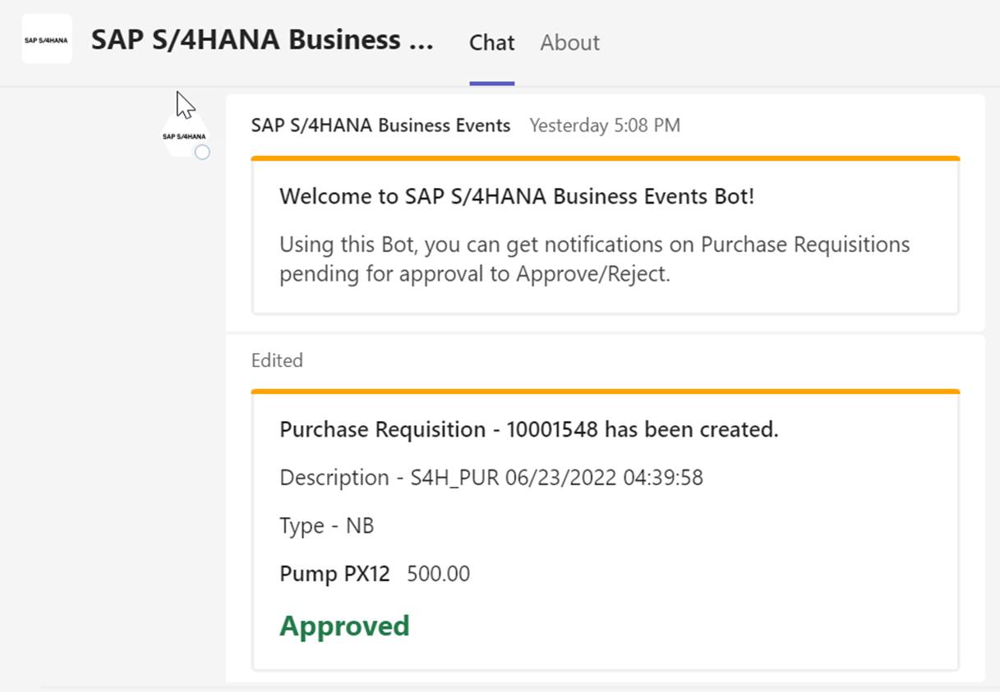
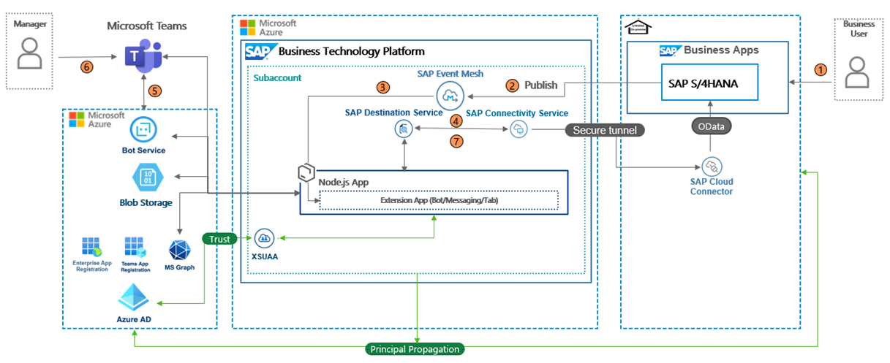
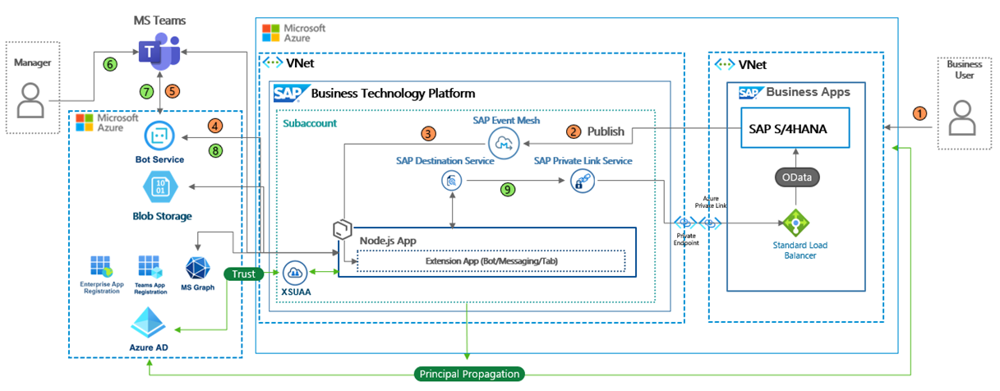

# Extend your SAP S/4HANA Business Scenarios into Microsoft Azure Ecosystem

This repository contains code samples and instructions for developing a native Microsoft Teams application that is deployed in SAP BTP. This application is used for extending the SAP S/4HANA Business scenarios.

This is how the extension application looks like:
 

  

 

***

 

> **Important Note** : Please be aware that this GitHub repository is still work in progress for improvements and additional scenarios. Make sure you're pulling the repository from time to time and redeploying it in SAP BTP.

## Table of Contents

[Scenario](#scenario)\
[Business Process Flow ](#business-process-flow)\
[Solution Architecture](#solution-architecture)\
&emsp;&emsp;[Connect to SAP S/4HANA Using SAP BTP Connectivity Service](#recommended-architecture-connect-to-s4-hana-on-azure-private-cloud-using-btp-connectivity-service)\
&emsp;&emsp;[Connect to SAP S/4HANA on Azure Using SAP BTP Private Link Service and Azure Private Link](#recommended-architecture-to-connect-to-s4-hana-on-azure-private-cloud-using-btp-private-link-service-and-azure-private-link)\
[Requirements](#requirements)\
[Implementation: Configuration and Development](#implementation--configuration-and-development)\
[Additional Resources](#additional-resources)\
[Known Issues](#known-issues)\
[Reference](#useful-links)\
&emsp;&emsp;[Build Apps for Microsoft Teams](#build-apps-for-microsoft-teams)\
&emsp;&emsp;[Microsoft Graph API](#microsoft-graph-api)\
&emsp;&emsp;[Bot Framework](#bot-framework)\
&emsp;&emsp;[Adaptive Cards](#adaptive-cards)\
[Disclaimer](#disclaimer)\
[How to Obtain Support](#how-to-obtain-support)\
[Code of Conduct](#codeofconduct)\
[Contributing](#contributing)\
[License](#license)

## Scenario:
The business scenario you will be implementing here will allow SAP enterprise business users to perform the ERP operations from Microsoft Teams. Business users can receive alerts or events from SAP S/4HANA for approvals or rejections of purchase requisitions.     

## Business Process Flow 
The extension application will provide the business user with the ability to perform ERP operations via Microsoft Teams.

1. User creates a purchase requisition in the SAP S/4HANA system, and a business workflow is started to release the purchase requisition. 
2. A background job running in the SAP S/4HANA system will pick the purchase requisition workflow instance and send an event for creating that purchase requisition to SAP Event Mesh.
3. The extension application deployed in SAP BTP receives this event via Webhook utility.
4. The extension application fetches the additional details of the purchase requisition by querying the SAP S/4HANA sytem using the SAP Destination service and SAP Connectivity service.
5. The extension application sends the notification to the corresponding approver of the purchase requisition to Microsoft Teams using the Azure Bot Service.
6. The approver can approve or reject the purchase requisition with a click of a button in the Microsoft Teams notification that calls the extension application.
7. The extension applications sends the approval or rejection status to the SAP S/4HANA system.

## Solution Architecture

We are giving two approaches for connecting SAP BTP and SAP S/4HANA.

The key services used from Microsoft Azure are the Azure Bot Service, Azure Blob Storage, Microsoft Graph, Microsoft Teams App Registration, Extension App Registration, and Azure Active Directory.

The services used from SAP BTP are the Cloud Foundry Runtime, SAP Event Mesh, SAP Connectivity service, SAP Private Link service, and SAP Destination service. 

### Connect SAP BTP and SAP S/4HANA using SAP Connectivity Service

This is a high-level solution architecture diagram that shows how to use the Cloud Connector and SAP Connectivity service to establish secured communication between SAP BTP and SAP S/4HANA. 

### Connect SAP BTP and SAP S/4HANA using SAP Private Link service

This is a high-level solution architecture diagram that shows how to use the SAP Private Link service and Azure Private Link service to establish secured communication between SAP BTP and SAP S/4HANA.

For more information, see [Set Up Connectivity Between SAP BTP and SAP S/4HANA Using SAP Private Link Service](./tutorial/Azure-Private-Cloud-PrivateLink/README.md) page.

**Note**: In this scenario, it is mandatory to configure principal propagation.

## Requirements 

These are the technical prerequistics for an integration between Microsoft Teams and SAP S/4HANA. 

**SAP S/4HANA**
- 2 business users (for the requestor and for the approver)

**Services in SAP BTP**
- Cloud Foundry Runtime
    > - Foundation for running the Microsoft Teams extension application
    > - Required for the trust between Microsoft Azure Active Directory and SAP BTP
- Memory/Runtime quota
    > - Required for deploying and running the extension application in SAP BTP
- Authorization & Trust Management Service
    > - Required for securing the extension application in SAP BTP

**Microsoft Azure and Microsoft Teams Subscription**
- A valid Microsoft Azure subscription
- A Microsoft Azure Active Directory
    > - Required for the trust between Microsoft Azure Active Directory and SAP BTP
    > - User management
    > - Application registrations to allow access to Microsoft Graph API and SAP BTP

- Microsoft Graph API
    > - Used to retrieve user profile information and MS Teams data (chat members, team members also)

- An Azure Bot Service
    > - Service for Azure bots
    > - Required for Bot connection between the extension application deployed in SAP BTP and Microsoft Teams

- An Azure Storage Account
    > - Required for storing the conversation references for the notifications

- A Microsoft Teams subscription
    > - Required for paid services like Azure Storage Account

**Additional Information**

- Establish trust between SAP BTP and Microsoft Azure Active Directory.
   
- The configurations required need admin user crdentials in all platforms (SAP BTP, Microsfot Azure, Microsoft Teams).

- Ensure the users created in Microsoft Azure, SAP BTP and SAP S/4HANA have the same email address. 

## Configuration and Development

These are the steps to configure SAP S/4HANA, SAP BTP and Microsoft Azure for this scenario.

[Step 1: Set Up the Subaccount in SAP BTP](./tutorial/Step1-Configure-SAP-BTP/README.md)

[Step 2: Configure Microsoft Azure Platform and Microsoft Teams](./tutorial/Step2-Configure-Azure/README.md)

[Step 3: Configure SAP S/4HANA For Business Scenario](./tutorial/Step3-Configure-SAP-S4HANA/README.md)

Step 4: Connect SAP BTP and SAP S/4HANA:

- [(Option 1) Using SAP BTP Connectivity Service](./tutorial/Step4-Configure-Cloud-Connector/README.md)

- [(Option 2) Using SAP Private Link Service](./tutorial/Azure-Private-Cloud-PrivateLink/README.md)

[Step 5: Build and Deploy the Extension Application](./tutorial/Step5-Deploy-Extension-Application/README.md)

[Step 6: Test the Extension Application](./tutorial/Step6-Testing-the-Application/README.md)

## Additional Resources

This project has been implemented based on the following Microsoft Bot Builder and Microsoft Office Developer sample repositories.

- [BotBuilder-Samples](https://github.com/microsoft/BotBuilder-Samples/tree/main/samples/typescript_nodejs/13.core-bot/)

- [Microsoft-Teams-Samples](https://github.com/OfficeDev/Microsoft-Teams-Samples/tree/main/samples/app-sso/nodejs/)

Another source of inspiration are the following blog posts by Martin Raepple on setting up principal propogation between  Microsoft Azure and SAP BTP.

- [Principal propagation in a multi-cloud solution between Microsoft Azure and SAP Business Technology Platform (BTP), Part I: Building the foundation](https://blogs.sap.com/2020/07/17/principal-propagation-in-a-multi-cloud-solution-between-microsoft-azure-and-sap-cloud-platform-scp/)

- [Principal propagation in a multi-cloud solution between Microsoft Azure and SAP Business Technology Platform (BTP), Part II: Connecting the system on-premise](https://blogs.sap.com/2020/10/01/principal-propagation-in-a-multi-cloud-solution-between-microsoft-azure-and-sap-cloud-platform-scp-part-ii/)
        

## Known Issues

These are the known issues that needs to be considered during the implementation. There will be updates to the repository. Pull the latest version and redeploy the application in SAP BTP.

- Mobile device optimization:

    The adaptive cards are not yet optimized for picture-perfect mobile rendering. Whereas the functionality is given, the appearance of the mobile interface could be improved. This could be another challenge when optimizing the extension application for your personal needs.

- User and admin consent:

    User and a potential admin consent have not been in scope of this application. Ensure you're granting admin consent in Microsoft Azure Active Directory for the application registration to prevent potential consent issues when calling APIs.

## Reference

### Build applications for Microsoft Teams
- [Documentation](https://docs.microsoft.com/en-us/microsoftteams/platform/overview)
- [Code samples](https://github.com/OfficeDev/Microsoft-Teams-Samples)

### Microsoft Graph API
- [Documentation](https://docs.microsoft.com/en-us/graph/)

### Bot Framework
- [Documentation](https://docs.microsoft.com/en-us/azure/bot-service/index-bf-sdk)
- [Send proactive notifications to users](https://docs.microsoft.com/en-us/azure/bot-service/bot-builder-howto-proactive-message)
- [Write directly to storage](https://docs.microsoft.com/en-us/azure/bot-service/bot-builder-howto-v4-storage)
- [Save user and conversation data](https://docs.microsoft.com/en-us/azure/bot-service/bot-builder-howto-v4-state)
- [Code samples](https://github.com/microsoft/BotBuilder-Samples)

### Adaptive Cards
- [https://adaptivecards.io/](https://adaptivecards.io/)
- [Designer](https://adaptivecards.io/designer/)

## Disclaimer
This project has been a proof of concept, including several limitations and prerequisites. The objective was to build a Microsoft Teams extension application for an SAP S/4HANA system. For this reason, the coding should not be seen as any recommendation for productive implementation. It fulfils the purpose and requirements of a proof of concept and is not intended for productive usage. It has been declared as pure proof of concept only to give the development teams ideas for solving potential challenges when integrating Microsoft Teams and SAP S/4HANA using SAP BTP.

## How to Obtain Support
[Create an issue](https://github.com/SAP-samples/<repository-name>/issues) in this repository if you find a bug or have questions about the content.
For additional support, [ask a question in the SAP Community](https://answers.sap.com/questions/ask.html).

## Contributing

If you wish to contribute code, offer fixes or improvements,  send a pull request. Due to legal reasons, contributors will be asked to accept a DCO when they create the first pull request to this project. This happens in an automated fashion during the submission process. SAP uses [the standard DCO text of the Linux Foundation](https://developercertificate.org/).

Refer to the [CONTRIBUTING](CONTRIBUTING.md) file for guidelines to contributions from external parties.

For additional support, [ask a question in the SAP Community](https://answers.sap.com/questions/ask.html).

## Code of Conduct
Refer to the [CODE OF CONDUCT](CODE_OF_CONDUCT.md) file.

## License
Copyright (c) 2022 SAP SE or an SAP affiliate company. All rights reserved. This project is licensed under the Apache Software License, version 2.0, except as noted otherwise in the [LICENSE](LICENSE) file.