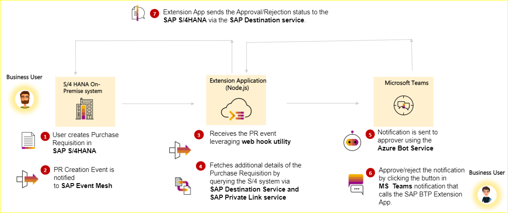
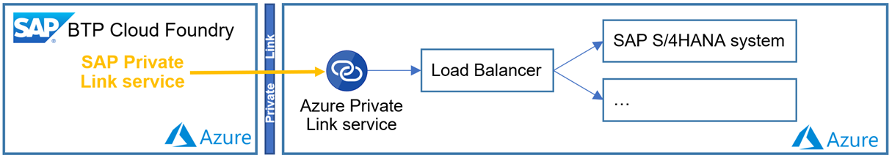
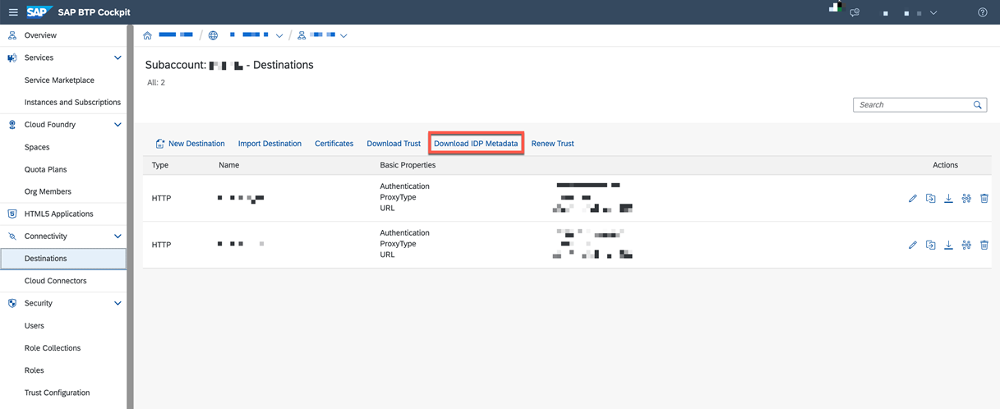

# Connect SAP BTP and SAP S/4HANA on Azure using SAP BTP Private Link service and Azure Private Link service

## Business Process Flow

The target application will provide the SAP Business user to perform ERP operations via MS Teams. Below depicts the business process flow for purchase requisition approval.

1. User creates purchase requisition in SAP S/4HANA system and a workflow is started in the SAP S/4HANA system for the release of PR.
2. A background job in SAP S/4HANA will pick the PR workflow instance and send the PR creation event to SAP Event Mesh.
3. Extension app deployed on BTP receives this event by using web hook utility.
4. Extension app fetches additional details of the purchase requisition by querying the SAP S/4HANA via SAP Destination service and Private Link service.
5. Extension app sends the notification to the configured approver of the PR via MS Teams using the Azure Bot Service.
6. The Approver can approve/reject the PR from MS Teams notification which inturn calls the extension app in SAP BTP.
7. Extension app sends the approval/rejection status to SAP S/4HANA.

## Solution Architecture

Recommended architecture to connect to SAP S/4HANA on Azure using BTP Private Link Service and Azure Private Link service
 

## Prerequisites

**SAP S/4HANA instance running on Azure**

**SAP Business Technology Platform Services**

- Cloud Foundry Subaccount
    
    - Foundation for running the MS Teams extension application.
    - Required for Azure AD - SAP BTP trust
    - Create and manage destinations 
    - Required to connect to SAP S/4HANA instance using SAP Private Link service 
    
- SAP Private Link service
    
    - Required to connect to SAP S/4HANA instance using Azure Private Link service 
    - SAP BTP Private Link service is currently only available on SAP BTP Enterprise Accounts and not available with SAP BTP trial account or as Free Tier service.

- Destination Service
    
    - Required to connect to SAP S/4HANA instance using SAP BTP Private Link service

**Microsoft Azure**

- Azure Private Link service
    
    - Required to connect to SAP S/4HANA instance from SAP BTP subaccount

## Setup and configure SAP Private Link service and Azure Private Link service 

**1. Create Azure Private Link service for SAP S/4HANA system**

Please check the following tutorial on [how to create Azure Private Link service for SAP S/4HANA system on Azure and link it with BTP Private Link service](https://github.com/SAP-samples/btp-build-resilient-apps/tree/extension-privatelink/tutorials/05-PrivateLink)

Complete the steps till "Prepare Extension Application" section using the above blog.

**2. Create Destination in SAP BTP**

Open the SAP BTP Cockpit. You should have subaccount administrator role assigned to your user-id.
Navigate to your subaccount account and select **Connectivity** –  **Destinations** from the left-side panel.
Click New **Destination**.

    key | value |
    --- | --- |
    Name | S4HANA_PL_NP |
    Type | HTTP |
    URL | https://your private hostname  |
    Proxy Type | PrivateLink |
    Authentication | BasicAuthentication |
    User| Technical User |
    Password| Technical User Password | 

    ### Additional Properties

    key | value |
    --- | --- |
    sap-client | your client no |
    TrustAll | true |
    HTML5.DynamicDestination | true |
    WebIDEEnabled | true |
    WebIDEUsage | odata_abap |

The below steps are needed only if you want to do Principal Propagation from Microsoft Teams and SAP BTP to SAP S/4HANA on Azure.

### oAuth Configuration for SAP S/4HANA and SAP BTP

Steps:

1. Navigate to your BTP Subaccount
2. Click on Connectivity -> Destinations
3. Click on "Download IDP Metadata" button to download IDP metadata. 

4. In SAP S/4HANA (Azure Private Cloud service) system, open the transaction "SAML2" or use the below url. 
   **URL** - https://s4hanahostname:port/sap/bc/webdynpro/sap/saml2?sap-client=clientnumber
5. Navigate to the **Trusted Providers** tab. 

6. In the table **List of Trusted Providers**, choose the value **OAuth 2.0 Identity Providers** from the dropdown as shown below: 

7. Click the **Add** button and choose **Upload Metadata File**. 

8. Click **Metadata File** input box, select the metadata file that you downloaded in **Step 3**, and click the **Next** button. 

9. Click **Next** again and click **Finish**. 
10. Select the added **Trusted Provider** and click the **Edit** button. 

11. Scroll down and navigate to the **Identity Federation** tab and click the **Add** button to add the NameID format. 

12. Select **Email ID** and click **Ok**. 

13. Scroll up and click **Save**. 
14. Click **enable** to enable to Trusted Provider. 

For registering an inbound OAuth client, you need to create an User ID in the system, which will be the Client ID.
15. Open transaction **SU01**, provide an unique **User** id and click Create icon as shown below: 

16. In the **Logon Data** tab, choose **Sytem** as the **User Type**.

17. Provide an initial password and click **Save**.
Now you will use the newly created system userid & the Trusted Provider to register an OAuth 2.0 client.

    You also need to provide read authorization for the OData service 'API_PURCHASEREQ_PROCESS_SRV' to the newly created user.
    >Note: Providing authorization here will help in setting up the SAP BTP destination in the upcoming steps.

    a. Open **PFCG** transacation, provide a role name and click **Create Single Role**. 

    b. In the **Authorizations** tab, click **Propose profile names** button to create a profile.

    c. Click **Change Authorizatoin Data** button to add the authorizations.
 
     **Note**: If a popup shows to save the role, click **Save** and if another popup opens to **Choose Template**, click **Do not select templates**. 
    d. Click **Manually** to add the Authorization object. 
 
    e. Enter the Authorization object **S_SERVICE** and click **Ok** button. 
 
    f. Click on **Edit** icon to provide the OData service details. 
 
    g. In the popup, select **TADIR Service**. 
 
    h. Provide the oData service details as shown below and click save. 
 
    i. Click **Save** again. 
 
    j. Click **Generate** icon to generate the profile. 
 
    k. Provide the user id and click **User Comparision**. 
 

18. Open the Transaction **SOAUTH2** or use the below URL to configure the oAuth and click **Create**. 
**URL** - https://s4hanahostname:port/sap/bc/webdynpro/sap/oauth2_config?sap-client=clientnumber

19. Enter the **User ID** from **Step 15** in the **OAuth 2.0 Client** input box, provide the description and click **Next**.

20. Click **Next** again.
21. In the **Resource Owner Authentication** step, choose the **Trusted OAuth 2.0 Identity provider** that you created in **Step 14** and click **Next**

22. In the **Scope Assignment**, add the Task Processing OData service **ZTASKPROCESSING_0002**, click **Next** and click **Finish**

**Optional**: If the OData service is not visible in **Step 22**, you need to manually enable OAuth for it.
23. Open the transaction **/n/iwfnd/maint_service**
24. Select the service **ZTASKPROCESSING** and click the **OAuth** button to enable OAuth scope for the service

### BTP Configuration

***Create Destinations*** 
We describe a set of Destinations, whereas the first one refers to the initial simple setup discussed in part 1 of the blog series. The next two are required to realize the SAMLAssertion flow. This additional complexity is due to the fact that the SAML2BearerAssertion flow cannot be used, because the BTP Private Link Service operates isolated from all other BTP services by design. As part of the flow the connectivity service would need to reach the OAuth2 server on the SAP backend but can't because it has no visibility of the private endpoint.

We could get away with 2 destinations, because the target configuration is the same except the authorization header. For a cleaner approach and better separation use a separate instance to avoid overriding authentication.

Open the BTP Cockpit in your browser and log in with your account admin.
Navigate to your BTP Subaccount and select **Connectivity** –  **Destinations** from the left side navigation menu.

1. Create a destination with name "s4BasicAuth"

Click New **Destination** and enter the following configuration values

key | value |
--- | --- |
Name | s4BasicAuth |
Type | HTTP |
URL | https://your private hostname |
Proxy Type | PrivateLink |
Authentication | Basic Authentication (TEAMSCLIENT) |
scope | ZTASKPROCESSING_0002 |
>Note: **TEAMSCLIENT** is the user that you created in the previous steps for the OAuth Client.
### Additional Properties

key | value |
--- | --- |
sap-client | your client no |
TrustAll | true |
HTML5.DynamicDestination | true |
WebIDEEnabled | true |
WebIDEUsage | odata_abap |

2. Create a destination with name "s4oauth" ( This is used to request SAMLAssertion from SAP backend (OAuth server))

key | value |
--- | --- |
Name | s4oauth |
Type | HTTP |
URL | https://your private hostname/sap/bc/sec/oauth2/token?sap-client=[your client no] |
Proxy Type | PrivateLink |
Authentication | SAMLAssertion |
Audience | check Provider Name on **SAML2 backend transaction** |
AuthnContextClassRef | urn:oasis:names:tc:SAML:2.0:ac:classes:x509 |

### Additional Properties

key | value |
--- | --- |
sap-client | your client no |
TrustAll | true |
HTML5.DynamicDestination | true |
WebIDEEnabled | true |
WebIDEUsage | odata_abap |
nameIdFormat | urn:oasis:names:tc:SAML:1.1:nameid-format:emailAddress |
tokenServiceURL  | https://your private hostname/sap/bc/sec/oauth2/token |
assertionRecipient  | https://your private hostname/sap/bc/sec/oauth2/token |
userSourceId  | email

3. Create destination "s4NoAuth" (This is used for final call to OData without Authentication, we inject the Bearer token from preceeding calls)

key | value |
--- | --- |
Name | s4NoAuth |
Type | HTTP |
URL | identical to first destination |
Proxy Type | PrivateLink |
Authentication | No Authentication |

### Additional Properties

key | value |
--- | --- |
sap-client | your client no |
TrustAll | true |
HTML5.DynamicDestination | true |
WebIDEEnabled | true |
WebIDEUsage | odata_abap |

For further details on Private Link service , please refer to the GitHub repository [az-private-linky](https://github.com/MartinPankraz/az-private-linky) by Martin Pankraz.
