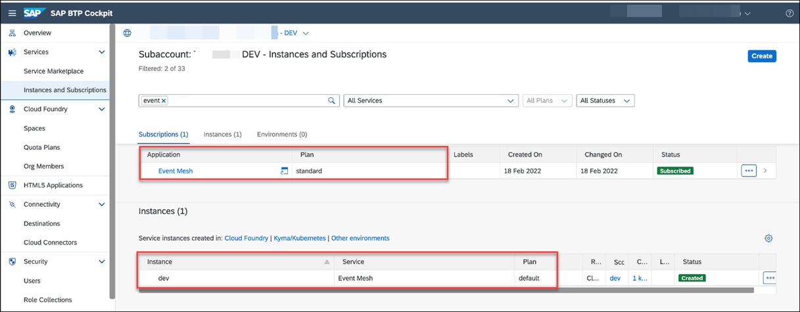
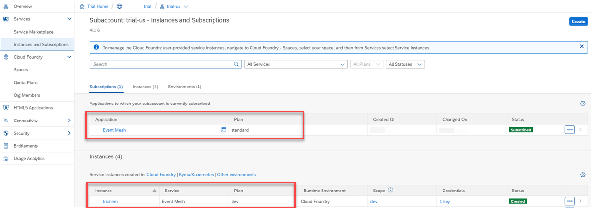
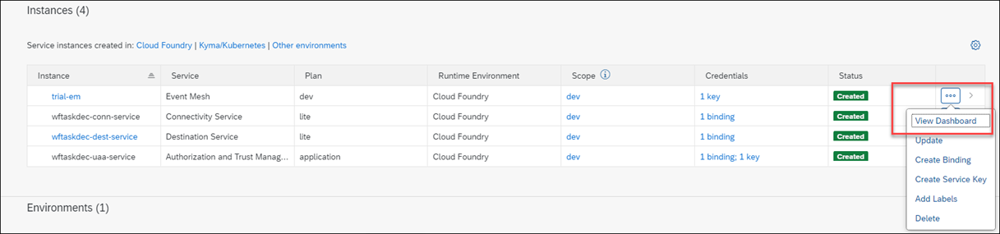
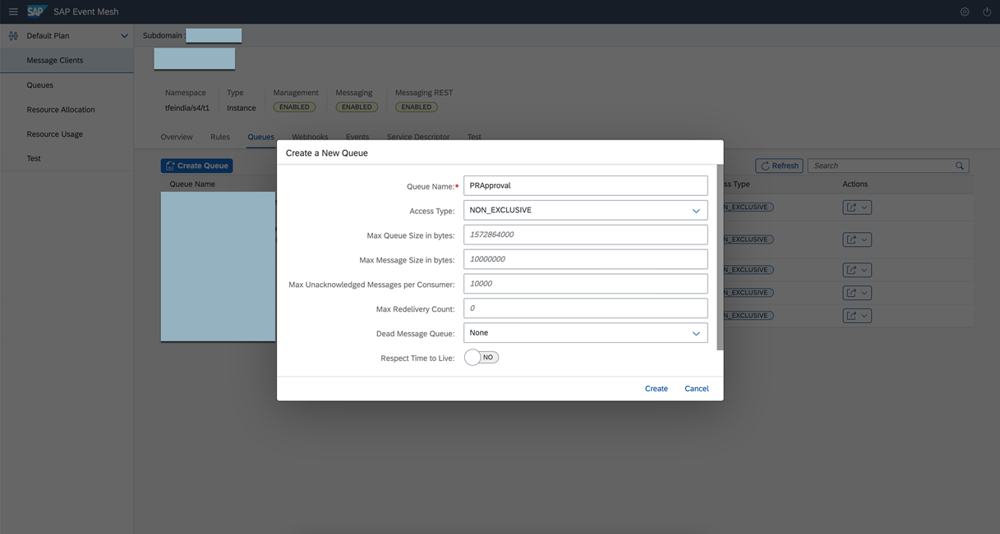
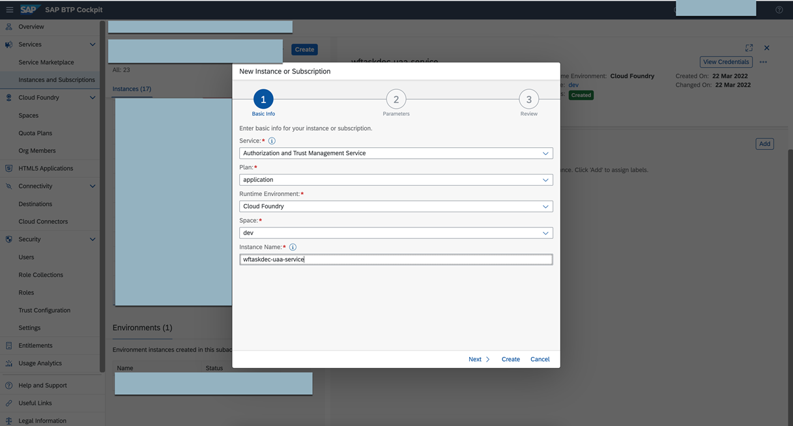
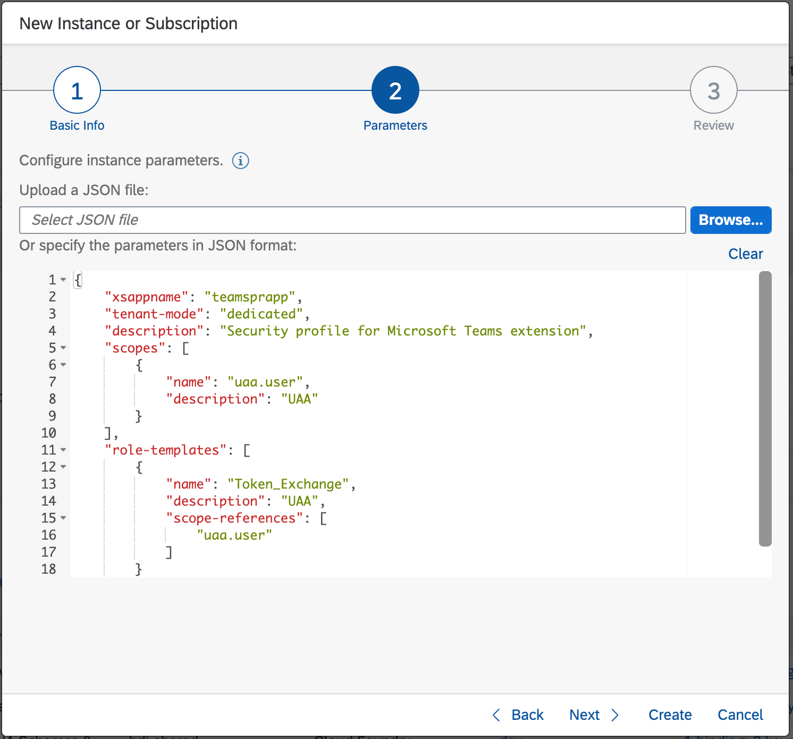
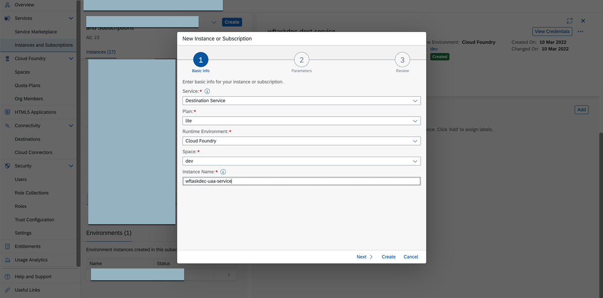
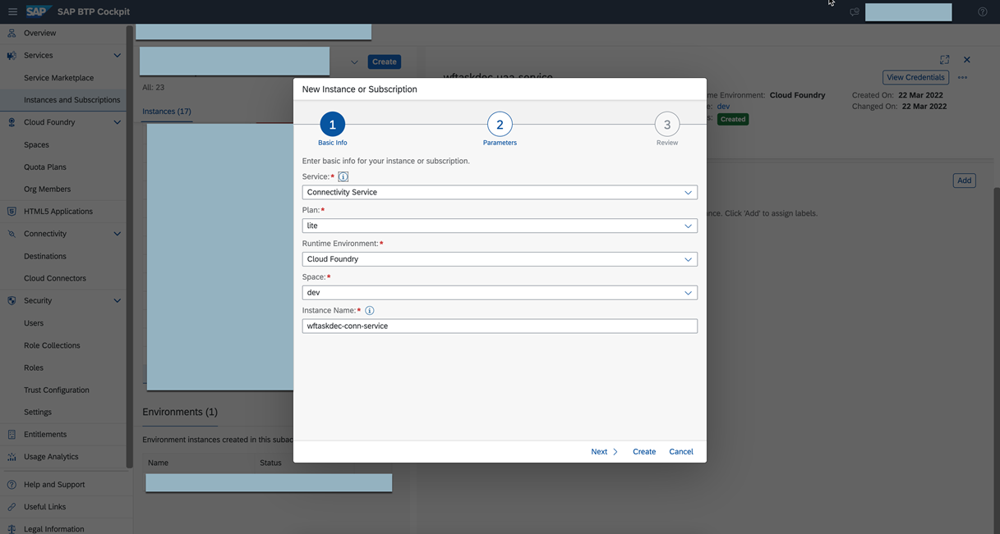

## Set Up the Subaccount in SAP BTP

### 1. Create or Use an Already Existing Subaccount in SAP BTP

You can use both trial and enterprise account in SAP BTP. To set up a trial account, see the [Get a Free Account on SAP BTP Trial](https://developers.sap.com/tutorials/hcp-create-trial-account.html) at SAP Tutorial Navigator.

You can use an existing subaccount or you can create a new one.

You need to have the Global Account Administrator role collection assigned to your user.

If you are new to SAP BTP, follow the [Get Ready to Develop on SAP BTP](https://developers.sap.com/group.scp-1-get-ready.html) tutorial at SAP Tutorial Navigator to get started with SAP BTP, create subaccounts and assign entitlements.

For this scenario you need the following configurations:

1. Log in to SAP BTP cockpit, navigate to your global account and create a subaccount or use an existing one.
2. Assign the following entitlements:

Service | Plan | Usage Scenario |
--- | --- | --- |
Cloud Foundry Runtime | MEMORY | Needed to run the application on SAP BTP, Cloud Foundry environment. The chosen quota defines the available amount of memory in GB. |
SAP Authorization and Trust Management Service | application | Required to authenticate access to the extension app's notification endpoint.|
SAP Destination Service | lite | Destination service lets you find the destination information required to access a remote service or system from your extension application.|
SAP Connectivity Service | lite | Connectivity service allows you to connect extension application to an on-premise system through the Cloud Connector.|
SAP Event Mesh | default | Messaging bus for inter-app communication within the Cloud Foundry environment.|

### 2. Set Up SAP Event Mesh

To learn how to use SAP Event Mesh and test a sample application, follow the [Get Started with Messaging for Decoupled Communication](https://developers.sap.com/group.cp-enterprisemessaging-get-started.html) tutorial.

In SAP BTP Enterprise account, you should be able to see the below details in Subcriptions and Instances.



In SAP BTP trial account, you will see the below details in Subscription and Instances.



To set up SAP Event Mesh for this scenario, follow these steps:

1. In the SAP BTP cockpit, navigate to your subaccount and choose **Services** > **Instances and Subscriptions**.

2. Open the SAP Event Mesh application:

    - If you are using SAP BTP Enterprise account, go to the **Subscriptions** tab and choose **Event Mesh** to open the application.

        

    
    - If you are using SAP BTP Trial account, go to **Instances** tab, select the instance for SAP Event Mesh and choose **View Dashboard**.

        

3. Choose **Message Clients** and then choose **Create Queue** to create your message client queue.

4. In the **Queue Name** field, enter **PRApproval** as shown in the screenshot.

    

### 3. Set Up SAP Authorization and Trust Management Service

You need the SAP Authorization and Trust Management service to authenticate the access to the extension app's notification endpoint.

See [SAP Authorization and Trust Management Service](https://help.sap.com/docs/CP_AUTHORIZ_TRUST_MNG). 

To set up the SAP Authorization and Trust Management service for this scenario, follow these steps:

1. In the SAP BTP cockpit, navigate to your subaccount and choose **Services** > **Instances and Subscriptions**.

2. Choose **Create** to create a service instance of the Authorization and Trust Management service with the following details:

```
Name: wftaskdec-uaa-service
Service: Authorization and Trust Management Service (xsuaa)
Plan: application
```


3. Choose **Next**, enter the following configuration parameters, and choose **Create**.

```
{
    "xsappname": "teamsprapp",
    "tenant-mode": "dedicated",
    "description": "Security profile for Microsoft Teams extension",
    "scopes": [
        {
            "name": "uaa.user",
            "description": "UAA"
        }
    ],
    "role-templates": [
        {
            "name": "Token_Exchange",
            "description": "UAA",
            "scope-references": [
                "uaa.user"
            ]
        }
    ],
    "role-collections": [
        {
            "name": "s4hana_procurement",
            "description": "S4HANA Procurement Role Collection",
            "role-template-references": [
                "$XSAPPNAME.Token_Exchange"
            ]
        }
    ]
}
```



### 4. Set Up SAP Destination Service

You need the SAP Destination service to access a remote service or system from your Cloud Foundry application. 

See [Create and Bind a Destination Service Instance](https://help.sap.com/docs/CP_CONNECTIVITY/cca91383641e40ffbe03bdc78f00f681/9fdad3cad92e4b63b73d5772014b380e.html) 

To set up the SAP Destination service for this scenario, follow these steps:

1. Navigate to your subaccount and choose **Services** > **Instances and Subscriptions**.

2. Choose **Create** to create a service instance of the Destination service with the following details:

```
Name : wftaskdec-dest-service
plan : lite
```



For the connection to an SAP S/4HANA system, you can optionally use this service, together with the SAP Connectivity service. 
See [Consuming the Connectivity Service](https://help.sap.com/docs/CP_CONNECTIVITY/cca91383641e40ffbe03bdc78f00f681/313b215066a8400db461b311e01bd99b.html?locale=en-US).


### 5.Set Up SAP Connectivity Service

You need the SAP Connectivity service to connect your **Node.js** extension application to an on-premise system through the SAP Cloud Connector. See [SAP BTP Connectivity](https://help.sap.com/docs/CP_CONNECTIVITY).

To achieve this, you must provide the required information about the target system (destination) and set up an HTTP proxy that lets your application access the on-premise system.

To set up the SAP Connectivity service for this scenario, follow these steps:

1. In the SAP BTP cockpit, navigate to your subaccount and choose **Services** > **Instances and Subscriptions**.

2. Choose **Create** to create a service instance of the Destination service with the following details:

```
Name: wftaskdec-conn-service
plan: lite
```


**Note**: If you change the names of any of the service instances so far (Authorization and Trust Management service instance, Destination service instance, Connectivity service instance), you need to adjust the **manifest.yml** file within your **Node.js** extension project. This will ensure correct binding of the respective instances to your extension application.
