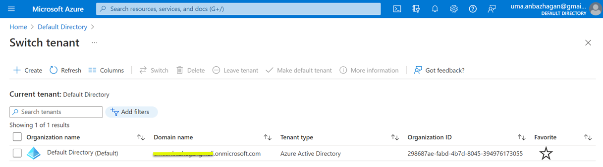
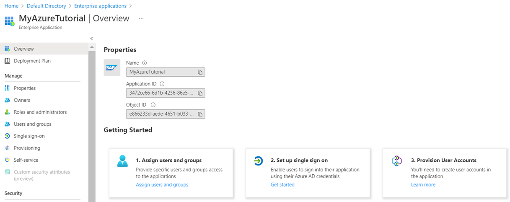

## Configure Microsoft Azure Platform and MS Teams

These are the Microsoft Azure services and components you will need for this scenario:

    - Azure Active Directory instance with admin access
    - Valid Azure subscription
    - Azure Bot service instance
    - Azure Storage account for bot to persist information
    - Microsoft Teams subscription

You will use Microsoft Azure Active Directory for maintaining application users and groups. Developments in Microsoft Azure environment starts with setting up the application registration. An application registration allows you to authenticate against your Azure Active Directory and offers dedicated settings for authentication, permission handling and so on. For this scenario, you will create an application registration for your Microsoft Teams extension as it will interact with Microsoft Graph and SAP BTP using Azure Active Directory authentication features.

If you don't have access to a Microsoft Azure account (including a paid or trial subscription), check out the [Unit 3: Microsoft Azure basics and setup](https://open.sap.com/courses/btpma1/items/1f82kP2dhVdZ6e9xia10A8) chapter in the latest openSAP course [Building Applications on SAP BTP with Microsoft Services](https://open.sap.com/courses/btpma1/). 

It explains in detail how to create a new Microsoft Azure account and get a free trial subscription. 
Once you have access to Microsoft Azure account, you will be able to see the following list of Azure services in portal.azure.com.
 

### 1. Create Tenant in Microsoft Azure - Azure Active Directory

1. Log in to [Microsoft Azure](http://portal.azure.com). 
2. Select Azure Active Directory. This is the information you will see in the Overview of Default Directory.

    

### 2. Establish Trust Between Azure Active Directory and SAP BTP
The key pillar of the principal propagation is to establish the trust between your Azure Active Directory and your subaccount in SAP BTP. 

1. Follow step 7 of the [Integrate Microsoft Azure AD with SAP BTP, Cloud Foundry Environment](https://developers.sap.com/tutorials/cp-azure-ad-saml.html#716a684a-b8fd-4d5b-9472-ba0cc82c01e3) tutorial.

    > Important: Check the Basic SAML configuration in Azure Active Directory again. Make sure you have changed the Reply URI from SAML/SSO to OAuth/token. It is mandatory to set the correct recipient URI in the SAML assertion.

    

    Furthermore, ensure that the user's email address (user. mail) is used as the Unique User Identifier (Name ID). Also, feel free to add additional claims if required, as depicted in the following screenshot.
    

2. Once the trust between Azure AD and SAP BTP is configured, go to SAP BTP cockpit, navigate to **Security** > **Trust Configuration** and select the configured identity provider from **Custom Identity Provider for Applications** as shown in screenshot.

    

3. Click on **Edit** to edit the Trust Configuration parameters. 

4. Uncheck the **Available for User Logon** field. The Azure Active Directory trust configuration is required for **technical purposes** (in this case, for principal propogation). Make sure that the checkbox for creating **Shadow Users** is **checked** as shown below.

    

### 3. Create Groups in Azure Active Directory

1. Login to **Microsoft Azure**. Choose **Azure Active Directory** and choose **Groups** > **New Group** to create a new security group.

2. In the **Group name** field enter **s4businessusergrp** as show in the screenshot.

    **Note**: All users who have access to SAP BTP extension application will have to be assigned to this group. 

3. The **Object Id** of this **Group** will be later mapped to a role collection in SAP BTP. Note down the **Object Id** from the Azure Portal. 

### 4. Create Users in Azure Active Directory

1. Login to **Microsoft Azure**. Choose **Azure Active Directory** and choose **Users** > **New User** to create a new user.
    

2. Ensure the **Email** field is updated for the newly created user. This field is important for principal propogation and this is required when receiving the events from SAP S/4HANA.The same email ID is configured for the named user in SAP S/4HANA.
    

### 5. Assign the Users to the Group

1. Login to **Microsoft Azure**. Choose **Azure Active Directory** and choose **Groups**.

2. Select the **s4businessusergrp** and click on **Users** under **Direct members** to add the user.

    

### 6. Assign Users and Groups to Enterprise applications

1. Go to **Azure Active Directory** in **Home** page and choose **Enterprise applications**.
    

2. If you are using a free subscription for Microsoft Azure, you need to add all (test) users manually, as groups cannot be added as shown in screenshot.
    

3. In case of paid subscription, the assignment will look as shown in screenshot.
    

### 7. Create SAP BTP Role Collection Mapping

1. Select **Azure Active Directory** > **Groups**. Select the Group **s4businessusersgrp** and copy the **Object Id**.

2. Log in to SAP BTP Account cockpit, navigate to you subacccount and choose **Security** > **Trust Configuration** and select the configured trust configuration from **Custom Identity Provider for Applications**. 

3. Choose **Role Collection Mappings** and then choose **New Role Collection Mapping**.

4. In the **Role Collection** field select **s4hana_procurement**.
5. In the **Attribute** field enter **Groups**.
6. In the **Value** field enter the value of **Object Id** from Microsoft Azure Group **s4businessusergrp**.
    
    

    **Note**:All MS Teams users who are authorized use the extension application need to have this group assinged in Azure Active Directory. This mapping allows the users(once their identity has been propagated to SAP BTP) to SAP S/4HANA based on their principal propagation identity.

### 8. Register an Enterprise application for Microsoft Teams Extension in Microsoft Azure

Before you continue, open this blog post [Get your Microsoft Azure settings ready](https://blogs.sap.com/2022/02/28/sap-ms-teams-7-get-your-microsoft-azure-settings-ready/)on getting Microsoft Azure ready for registration of an application for MS Teams Extension.
You can refer to the above blog, where similar steps and detailed explanations are provided for the Success Factors Integration example. Here we have provided similar steps in the Azure trial account and provided a screenshot for your quick reference.

1. Navigate to **Microsoft Azure** > **Azure Active Directory** > **Enterprise applications**.

2. Choose **New application**. 

    Enter **MicrosoftTeamsS4App** in the **Name** field. 
    
    Select **Accounts in any organizational directory(Any Azure AD directory - Multitenant)** under **Supported account types**.

    Enter **Web** and enter **https://localhost** under **Redirect URI(optional)** as shown in screenshot.
    
    

3. Once the application registration is created, note down the **Application(client) ID** and **Directory(tenant) ID** from **Overview**

4. Choose **Certificates & Secrets** and select **New client secret** to create a new client secret and value. Note down the **Client Secret Value** and **Secret ID**.

5. Choose **Expose an API** and follow the instructions and explanations for how to form this Application ID URI from Step 4, 5, 6 and 7 in [Get your Microsoft Azure settings ready](https://blogs.sap.com/2022/02/28/sap-ms-teams-7-get-your-microsoft-azure-settings-ready/).

    Your configuration should look like below.

    

    You will have to change the Application ID URI. 

6. Choose **Authentication** in the sub-menu and choose **Web** > **Redirect URIs** from **Platform configurations** to update the tokens that you would like to be issued by the authorization endpoint as below. Refer to Steps 8 and 9 in [Get your Microsoft Azure settings ready](https://blogs.sap.com/2022/02/28/sap-ms-teams-7-get-your-microsoft-azure-settings-ready/).
Your configuration should have 2 URLs configured as shown below.

    

    Activate the Access tokens and ID tokens. 

7. To configure the Microsoft Graph API Permissions in **API permission**, go through steps 10 & 11 in [Get your Microsoft Azure settings ready](https://blogs.sap.com/2022/02/28/sap-ms-teams-7-get-your-microsoft-azure-settings-ready/).

    Click on **Add a permission** and select **Microsoft Graph** from **Request API permissions** as shown in screenshot.

    

    There are two types of permissions - Delegated and Application.

    

    Your configurations should look as below.
    

8. Follow the steps of 'Enable the SAP BTP integration for your application' from the [Get your Microsoft Azure settings ready](https://blogs.sap.com/2022/02/28/sap-ms-teams-7-get-your-microsoft-azure-settings-ready/).

    

    Select expose an API and configure the client, as shown below.
    

    **Note**: The client ID you are mentioning here is that of the app registration which you created.

### 9. Create Azure Bot Service

1. Log in to **Microsoft Azure** and search for the Marketplace.

2. Search for **Azure Bot** and choose to **Create**.

    

3. Once you have the Azure Bot has been created, add Microsoft Teams to the connected channels and complete all the configurations as mentioned in the [Get your Microsoft Azure settings ready](https://blogs.sap.com/2022/02/28/sap-ms-teams-7-get-your-microsoft-azure-settings-ready/).

    You should be able to see the final configurations as shown in screenshot.

    

4. Click on Test Connection and test both the OAuth connection settings (GraphConnection and BTPConnection).

    When testing the connection, when prompted for user credentials, enter the test user credentials.
    

### 10. Create Azure Storage Account

1. Log in to **Microsoft Azure** > **Storage accounts** to create a storage account. 

    Select **Free Trial** in **Subscription** field.
    
    Select **SAPResourceGrp** in **Resource group** field.

    Enter **businessbots** in **Storage account name** field.

    

2. Select **Advanced** Tab and make sure the blob public access is disabled before clicking on Review+Create.

3. Once the storage account is successfully created, go to the resource and add a container and note down the connection strings from the Access Keys.

    

4. Note down the container name and the connection string from the configuration. This will be used in environmental variables.

    

    

### 11. Log In to Microsoft Teams 

1. Log in to [Microsoft Teams](https://teams.microsoft.com/) with test user credentials.

    

In case you do not see this, check for details in the [Get your Microsoft Azure settings ready](https://blogs.sap.com/2022/02/28/sap-ms-teams-7-get-your-microsoft-azure-settings-ready/) blog post under Section - Microsoft Teams licence. You can assign the licence to the AD users.

This completes all the configurations on the Microsoft Azure.
We will need to revisit and update a few configurations after we complete the deployment of the SAP BTP Extension application.
