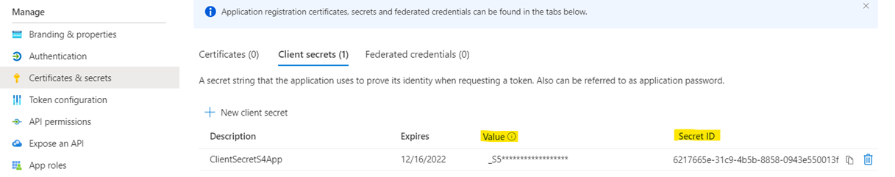
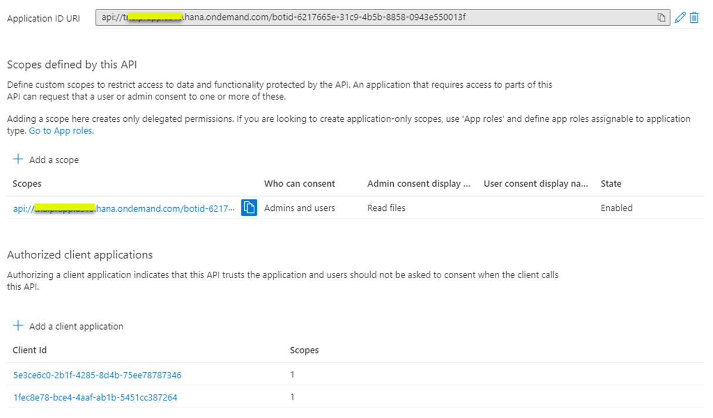
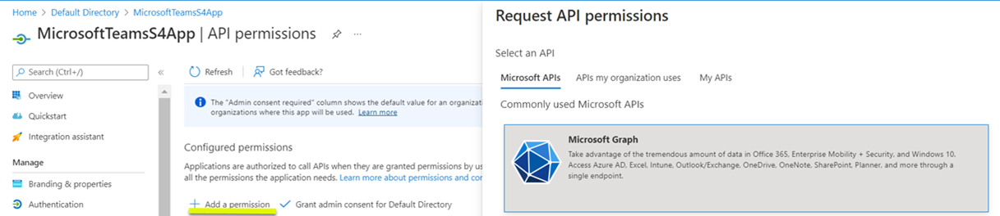
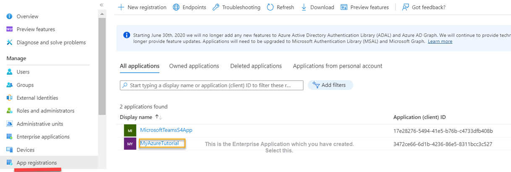
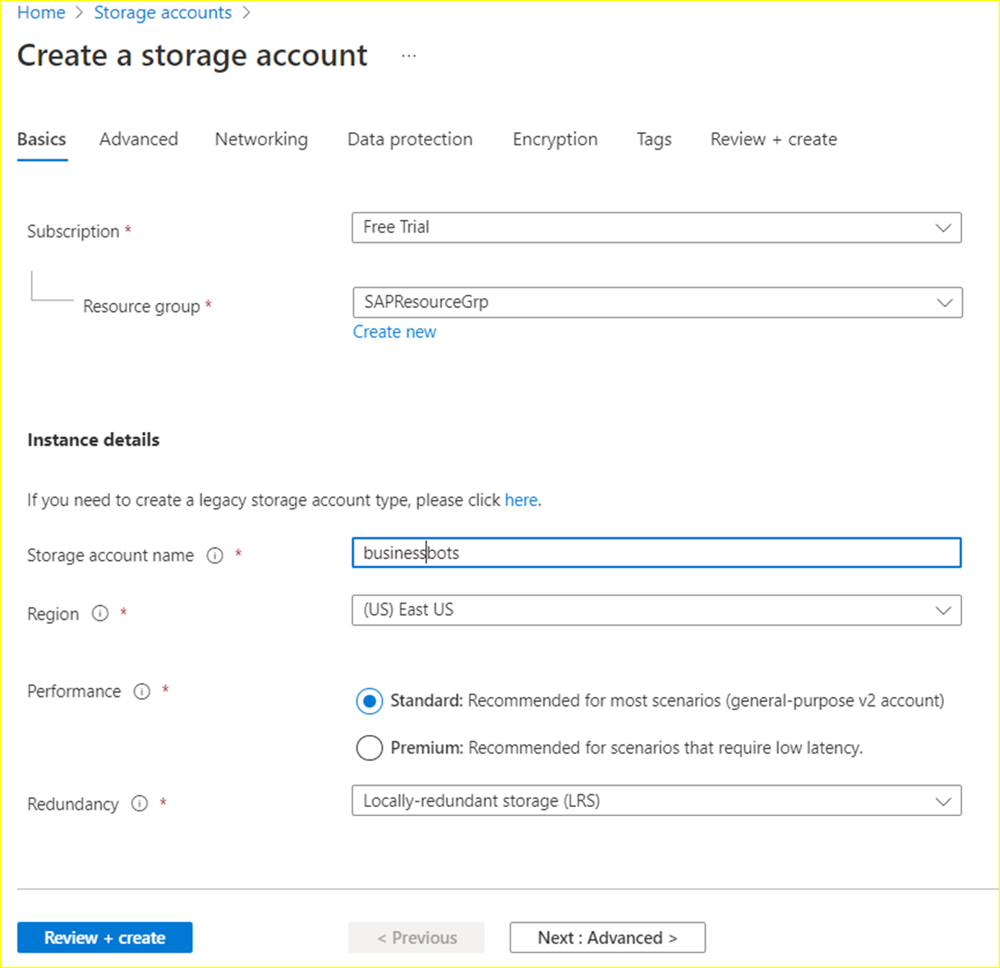

## Configure Microsoft Azure Platform and MS Teams

These are the Microsoft Azure services and components you will need for this scenario:

    - Azure Active Directory instance with admin access
    - Valid Azure subscription
    - Azure Bot service instance
    - Azure Storage account for bot to persist information
    - Microsoft Teams subscription

You use Microsoft Azure Active Directory for maintaining application users and groups. Development in Microsoft Azure environment starts with setting up the application registration. An application registration allows you to authenticate against your Azure Active Directory and offers dedicated settings for authentication, permission handling and so on. 

For this scenario, you create an application registration for your Microsoft Teams extension as it interacts with Microsoft Graph and SAP BTP using Azure Active Directory authentication features.

If you don't have access to a Microsoft Azure account (including a paid or trial subscription), check out the [Unit 3: Microsoft Azure basics and setup](https://open.sap.com/courses/btpma1/items/1f82kP2dhVdZ6e9xia10A8) chapter in the latest openSAP course [Building Applications on SAP BTP with Microsoft Services](https://open.sap.com/courses/btpma1/). 

It explains in detail how to create a new Microsoft Azure account and get a free trial subscription. 
Once you have access to Microsoft Azure account, you will be able to see the following list of Azure services in portal.azure.com.
 

### 1. Create Tenant in Microsoft Azure - Azure Active Directory

1. Log in to [Microsoft Azure](http://portal.azure.com). 
2. Select Azure Active Directory. This is the information you should see in the Overview of the **Default Directory** page.

    

### 2. Establish Trust Between Azure Active Directory and SAP BTP
The key pillar of the principal propagation is to establish the trust between your Azure Active Directory and your subaccount in SAP BTP. 

1. Follow step 7 of the [Integrate Microsoft Azure AD with SAP BTP, Cloud Foundry Environment](https://developers.sap.com/tutorials/cp-azure-ad-saml.html#716a684a-b8fd-4d5b-9472-ba0cc82c01e3) tutorial.

    > Important: Check the Basic SAML configuration in Azure Active Directory again. Make sure you have changed the **Reply URL** from SAML/SSO to **OAuth/token**. It is mandatory to set the correct **Reply URL** in the SAML assertion.

    

    Furthermore, ensure that the user's email address (user. mail) is used as the **Unique User Identifier (Name ID)**. Also, feel free to add additional claims if required, as depicted in the following screenshot.

    

2. Once the trust between Azure Active Directory and SAP BTP is configured, go to SAP BTP cockpit, navigate to **Security** > **Trust Configuration** and select the configured identity provider from **Custom Identity Provider for Applications** as shown in the screenshot.

    

3. Choose **Edit** to change the Trust Configuration parameters. 

4. Deselect the **Available for User Logon** checkbox. The Azure Active Directory trust configuration is required for  for principal propogation.

5. Select the **Create Shadow Users on User Logon** checkbox.

    

### 3. Create Groups in Azure Active Directory

1. Log in to **Microsoft Azure**. Choose **Azure Active Directory** and then choose **Groups** > **New Group** to create a new security group.

2. In the **Group name** field, enter **s4businessusergrp**.

    **Note**: All users who have access to the extension application deployed in SAP BTP have to be assigned to this group. 

3. Copy the value of the **Object Id** field of the group which you just created. This value will later be mapped to a role collection in SAP BTP. 

    

### 4. Create Users in Azure Active Directory

1. Log in to **Microsoft Azure**. Choose **Azure Active Directory** and then choose **Users** > **New User** to create a new user.
    

2. In the **Email** field, enter the email ID of the newly created user. This field is important for the principal propogation and it is required when receiving the events from SAP S/4HANA. The same email ID is configured for the named user in SAP S/4HANA.
    

### 5. Assign the Users to the Group

1. Log in to **Microsoft Azure**. Choose **Azure Active Directory** and then choose **Groups**.

2. Select the **s4businessusergrp** group and in the **Direct members** section choose **Users** to add the user.

    

### 6. Assign Users and Groups to Enterprise Applications

1. In **Azure Active Directory**, go to the **Home** page and choose **Enterprise applications**.
    

2. To add users consider your subscription on Microsoft Azure.

    - If you are using a free subscription for Microsoft Azure, you need to add all (test) users manually, as you cannot add groups.

        

    - In case of paid subscription, the assignment will look as shown in the screenshot.

        

### 7. Create Role Collection Mapping in SAP BTP 

1. Choose **Azure Active Directory** > **Groups**. Choose the **s4businessusersgrp** group and copy the value of **Object Id** field.

2. Log in to SAP BTP cockpit, navigate to you subacccount and choose **Security** > **Trust Configuration**. Edit the trust configuration you created in step 1. This configuration is in the **Custom Identity Provider for Applications** section.

    

3. Choose **Role Collection Mappings** and then choose **New Role Collection Mapping**.

    - In the **Role Collection** field, select **s4hana_procurement** from the dropdown menu.
    
    - In the **Attribute** field, enter **Groups**.

    - In the **Value** field, enter the value of the **Object Id** field you copied from the **s4businessusergrp** group in Microsoft Azure.

    

4. Choose **Save**.

    

    **Note**: All Microsoft Teams users who are authorized use extension application need to have this group assigned in Azure Active Directory. This mapping allows the users to propagated to SAP S/4HANA based on their principal propagation identity.

### 8. Register an Enterprise Application for Microsoft Teams Extension in Microsoft Azure

Before you continue, read the [Get your Microsoft Azure settings ready](https://blogs.sap.com/2022/02/28/sap-ms-teams-7-get-your-microsoft-azure-settings-ready/) blog post.

This blog post explains how to get Microsoft Azure ready for registration of an extension application for Microsoft Teams.
We will use SAP S/4HANA instead of SAP SuccessFactors.

Based on the blog post, follow these steps:

1. Navigate to **Microsoft Azure** > **Azure Active Directory** > **Enterprise applications**.

2. Choose **New application**. 

    - In the **Name** field, enter **MicrosoftTeamsS4App**.
    
    - In the **Supported account types** section, select **Accounts in any organizational directory(Any Azure AD directory - Multitenant)**.

    - In the **Redirect URI(optional)** section, select **Web** from the dropdown menu and then enter **https://localhost**.
    
    

3. Once the application registration is created, choose **Overview** and then copy  the values of the **Application(client) ID** and **Directory(tenant) ID** fields.

    

4. Choose **Certificates & secrets** and then choose **New client secret** to create a new client secret and value. Copy the values of the **Client Secret Value** and **Secret ID**.

5. Choose **Expose an API** and follow steps 4, 5, 6 and 7 from the [Get your Microsoft Azure settings ready](https://blogs.sap.com/2022/02/28/sap-ms-teams-7-get-your-microsoft-azure-settings-ready/) blog post to get the instructions and explanations for how to form the Application ID URI.

    Your configuration should look like this:

    

    You will have to change the details of the Application ID URI after the extension application is deployed in SAP BTP.

6. Update Authentication

    - Under **Platform configurations** section, choose **Web** > **Redirect URIs**. 
    
    - Refer to steps 8 and 9 in the [Get your Microsoft Azure settings ready](https://blogs.sap.com/2022/02/28/sap-ms-teams-7-get-your-microsoft-azure-settings-ready/) blog post.

        Your configuration should have two URLs configured as shown in the screenshot.

        

     - Select both the checkbox under **Implicit grand and hybrid flows** to activate the Access tokens and ID tokens. 

        

7. Add the API permissions.

    - Choose **Add a permission** and in the **Request API permissions** page choose **Microsoft Graph**.

        

    - There are two types of permissions - Delegated and Application.

        

    - Follow steps 10 and 11 in the [Get your Microsoft Azure settings ready](https://blogs.sap.com/2022/02/28/sap-ms-teams-7-get-your-microsoft-azure-settings-ready/) blog post to configure the Microsoft Graph API Permissions.

        Your configuration should look like this:

        

8. Follow the steps of the **Enable the SAP BTP integration for your application** section from the [Get your Microsoft Azure settings ready](https://blogs.sap.com/2022/02/28/sap-ms-teams-7-get-your-microsoft-azure-settings-ready/) blog post.

    The result should look like this:

    

    

### 9. Create Azure Resource Groups

1. In the Azure portal, navigate to the **Home** page and choose **Resource groups**.

    

2. In the **Basics** tab, in the **Project details** section, in the **Resource group** field, enter **SAPResourceGrp**.

    

### 10. Create Azure Bot Service

1. Log in to **Microsoft Azure** and search for the Marketplace.

2. Search for **Azure Bot**, select the **Azure Bot** tile and then choose **Create**.

    

3. Once you have the Azure Bot service created, add Microsoft Teams to the connected channels and complete all the configurations as described in the [Get your Microsoft Azure settings ready](https://blogs.sap.com/2022/02/28/sap-ms-teams-7-get-your-microsoft-azure-settings-ready/) blog post.

    The final configurations should look like this:

    

4. In the OAuth connection settings, choose **GraphConnection** and then choose **Test Connection**.

    Repeat the same for **BTPConnection**.

    When testing the connection, when prompted for user credentials, use the credentials for the test user you created in the **4. Create Users in Azure Active Directory**.

    

### 11. Create Azure Storage Account

1. Choose **Storage accounts**.

   - In the **Subscription** dropdown menu, select **Free Trial**.
    
    - In the **Resource group**  dropdown menu, select **SAPResourceGrp**.

    - In the **Storage account name** field, enter  **businessbots**.

         

2. In the **Advanced** tab, in the **Security** section, deselect the **Allow enabling public access on containers** checkbox.

    

3. Choose **Review + create** to create the storage account.

3. Choose the created storage account and then choose **Containers**.

   

4. Choose **Access keys** and copy the value of the **Storage account name** and value of the **Connection string** field. This will be used later on in the environment variables configuration of the extension application deployed in SAP BTP.

   

### 12. Log In to Microsoft Teams 

1. Log in to [Microsoft Teams](https://teams.microsoft.com/) with the test user credentials.

    

In case you do not see this, check for details in the [Get your Microsoft Azure settings ready](https://blogs.sap.com/2022/02/28/sap-ms-teams-7-get-your-microsoft-azure-settings-ready/) blog post under Section - Microsoft Teams licence. You can assign the licence to the Active Directory users.

This completes all the configurations on the Microsoft Azure side.

You will need to revisit and update a few configurations after you have deployed the extension application in SAP BTP.
