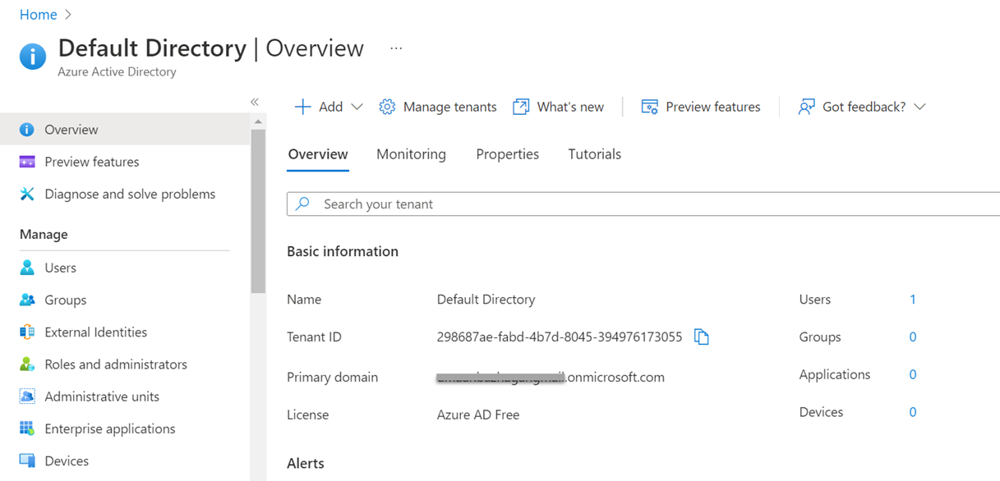
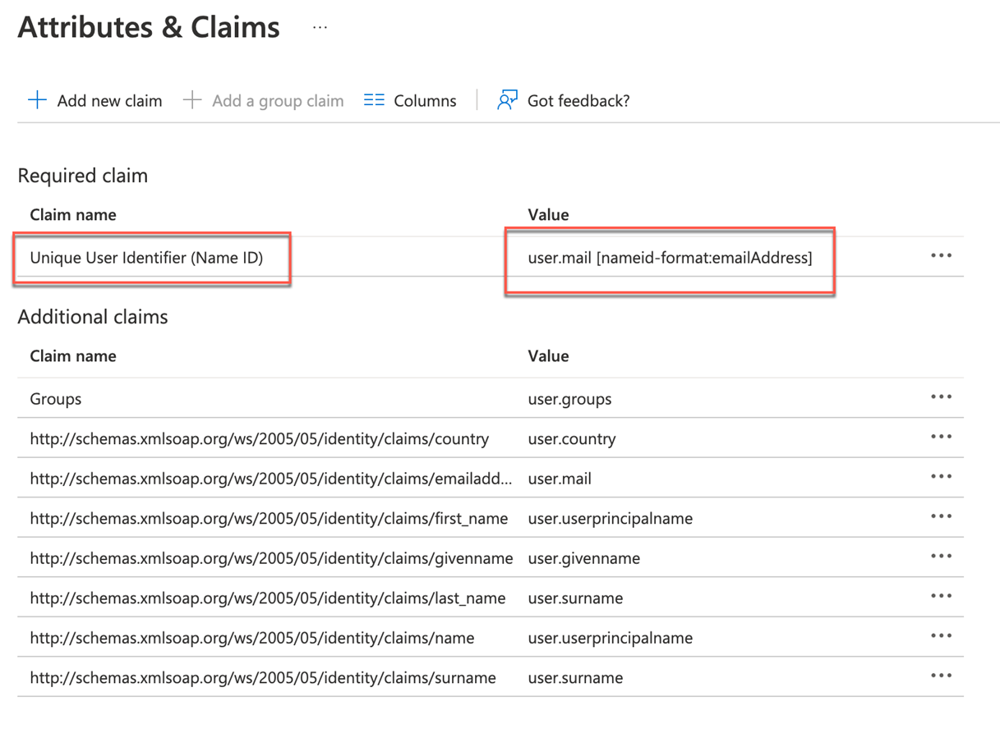
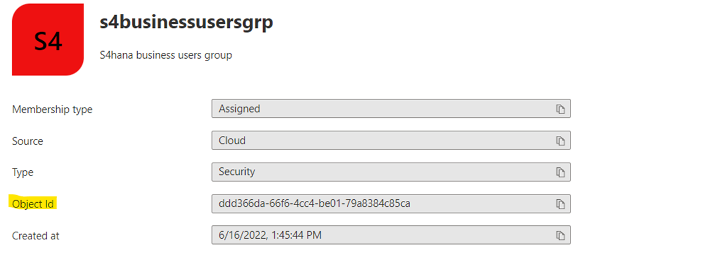
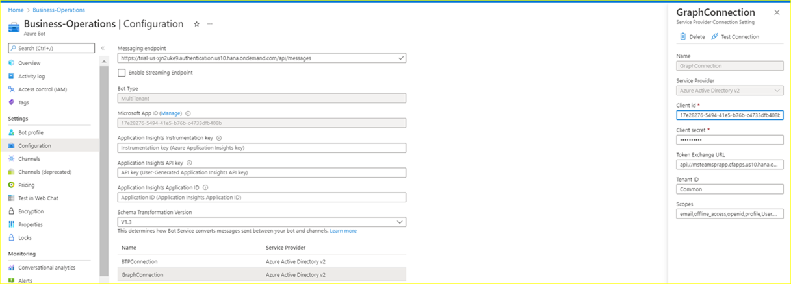

## Setup and Configurations in Microsoft Azure Platform and MS Teams

We will maintain app users and groups within the Microsoft Azure environment, define application registration, and configure trust between Microsoft Azure and SAP BTP.
The list of Azure components that we will configure is as below  

    Azure Active Directory instance with admin acess  
    Valid Azure subscription  
    Azure Bot service instance  
    Azure Storage account for bot to persist information  
    Microsoft Teams subscription 

If you don't have access to a Microsoft Azure account (including a paid or trial subscription), check out the following tutorial in the latest openSAP course (click here). It explains in detail how to create a new Microsoft Azure account and get a free trial subscription.

Register at https://portal.azure.com and get started with configurations. 

Once you have registred, you will be able to see the below list of services in portal.azure.com
 

## 1. Azure Services - Azure Active Directory
Go to Azure Services and select Azure Active Directory. You should be able to see the below information in the Overview of Default Directory.

The default directory as below 

Option to create and manage tenants

## 2. Establish trust between Azure AD and SAP BTP
The key pillar of the Principal Propagation process is the trust between your Azure Active Directory and your SAP BTP subaccount. This trust needs to be established by you within the Azure AD and your SAP BTP subaccount.

Please check the following tutorial on how to establish trust between Microsoft Azure Active Directory and an SAP BTP subaccount.

https://developers.sap.com/tutorials/cp-azure-ad-saml.html#716a684a-b8fd-4d5b-9472-ba0cc82c01e3

> Important: Please check the below configurations once more. Make sure while following the configuration process in Azure AD, you need to change the Reply URI in the SAML configuration from SAML/SSO to oAuth/token. This is mandatory to set the correct recipient URI in the SAML assertion.

Furthermore, ensure that the user's email address (user. mail) is used as the Unique User Identifier (Name ID). Also, feel free to add additional claims if required, as depicted in the below screenshot.

**Disable User Logon**
Once the **trust is configured** in Azure AD and SAP BTP, you can disable the BTP **Logon** using this IdP for users. The Azure AD IdP trust is only required for **technical purposes** (in this case, the Principal Propagation). Please make sure that the checkbox for creating **Shadow Users** is **checked**.

Now that the trust is established between Azure AD( productive / trial account) to SAP BTP on Azure(productive/trial account )), let us proceed with mapping role collection mapping as the next step.

## 3. Create Group and Test Users in Azure AD

## Groups in Azure 
Go to Default Directory and click on Groups - New Group.
Create a new security group with the name s4businessusergrp. 

All users supposed to use the new extension application have to be assigned to this group. 

The Object ID of this user group will later be mapped to a role collection in SAP BTP. So, before you move on, please note down the Object ID from the SAP BTP -> Trust Configurations -> Role Collection - Overview section. The group assignment of your Active Directory users will be provided to SAP BTP using the Groups claim of your SAML configuration. 

## Create users in Azure
Go to Default Directory and click on Users - New User, as shown below.

Ensure the email id is updated for the newly created user. This field is important and required when we are receiving the events from SAP S/4HANA.

## Assign the users to the group

## 4. Enterprise application user (group) assignment

Go back to the default directory and select the enterprise application that was created when you set up the trust between Azure AD and SAP BTP.

Hint – Please be aware that if you're using a free Azure Active Directory, you have to add all (test) users manually, as groups cannot be added. Nevertheless, the previous group assignment will be available in SAP BTP via the configured SAML claim.

Please see the below screenshot for the same. For a trial account, the assignment will look at below.

In case of paid subscription , the assignment will look at below 

The required Role Collection Mapping on the SAP BTP side will be done in one of the next steps.

## 5. SAP BTP Role Collection Mapping

Please check: In the SAP BTP configurations, you would have created a role collection s4hana_procurement. You will need to update this Role collection with the GroupID detail from Azure.

Copy the Group ID from the created group (s4businessusersgrp)

Go to your SAP BTP Account Cockpit - Select Subaccount - go to Security -> Trust Configuration, 

Open the Role Collection Mapping for Azure Identity Provider. In this case, we look at the trialAzureAD. Update the ObjectID details to as value against the attribute Group as shown below,
 

All MS Teams users supposed to use the extension application have to be assigned to this Azure AD group. This mapping allows the users (once their identity has been propagated to SAP BTP) to SAP S/4HANA based on their Principal Propagation identity.

Now that we have enabled the trust between SAP BTP and Microsoft Azure and 
Please perform the steps given in the following blog post on getting Microsoft Azure ready for registration of an application for MS Teams Extension

https://blogs.sap.com/2022/02/28/sap-ms-teams-7-get-your-microsoft-azure-settings-ready/

You can refer to the above blog, where similar steps and detailed explanations are provided for the Success Factors Integration example. Here we have provided similar steps in the Azure trial account and provided a screenshot for your quick reference.

Please ensure you read this blog post to understand each of the configuration details mentioned below. You will need to refer to the blog post for the below steps.

## 6. Register an application for Microsoft Teams Extension

Before you continue, open this blog post https://blogs.sap.com/2022/02/28/sap-ms-teams-7-get-your-microsoft-azure-settings-ready/

a) Create new app registration for the MS Teams extension application as below.
 

b) Update the Support account types to "Accounts in any organizational directory(Any Azure AD directory - Multitenant)

c) Update the Redirect URI. Select Web and update the URL as https://localhost for now.

d) Note down the Application Client ID and Directory(Tenant ID) of the app registration.
  

e) Create new Client Secret and Value and not down the Client Secret Value
   

f) Expose an API by clicking on Set in the sub-menu. Follow the instructions and explanations for how to form this Application ID URI from Blog Post - Steps 4,5,6, and 7.

Your configuration should look like below 

Note: You will have to change the Application ID URI. 

e) Click on Authentication in the sub-menu and configure the Redirect URIs for app registration and update the tokens that you would like to be issued by the authorization endpoint as below. Refer to Steps 8 and 9 from Blog Post.
Your configuration should have 2 URLs configured as shown below 

You will also activate the Access tokens and ID tokens. 

f) Next will be to configure the Microsoft Graph API Permissions. Go through Steps 10 & 11 in the blog post for more details. 

Click on Add permission and select Microsoft Graph.

 There are two types of permissions - Delegated and Application.

Please follow the table in the blog post.
Post following the steps, your configurations should look as below.

g) Following the steps of 'Enable the SAP BTP integration for your application' from the blog post.

Select expose an API and configure the client, as shown below. 

Note: The client ID you are mentioning here is that of the app registration which you created.

## 7. Create Azure Bot Service

Go to the home screen at http://portal.azure.com and search for the marketplace.

Look for Azure Bot and start to create.

Once you have the Azure Bot has been created, go ahead and add Microsoft Teams to the connected channels and complete all the configurations as mentioned in the blog post.

You should be able to see the final configurations below

Click on Test Connection and test both the OAuth connection settings (GraphConnection and BTPConnection).

When testing the connection, when prompted for user credentials, use the test user created.
We are using Test User to test the connection.

## 8. Create Azure Storage Account

The next step is to create the Azure Storage Account.

Click on Advanced Tab and make sure the blob public access is disabled before clicking on Review+Create.

Once the storage account is successfully created, go to the resource and add a container and note down the connection strings from the Access Keys.

Note down the container name and the connection string from the configuration. This will be used in environmental variables.

## 8. Login to MS Teams 

With the test user, you created, login to https://teams.microsoft.com/. You should be able to see the below screen 

In case you do not see this, then check for details in the blog post under Section - Microsoft Teams licence. You can assign the licence to the AD users.

This completes all the configurations on the Azure side.
We will need to revisit and update a few configurations after we complete the deployment of the SAP BTP Extension application.