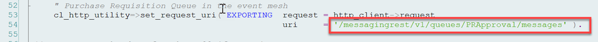

## Configure SAP S/4HANA For Business Scenario
In this section, you will configure the purchase requisition flexible workflow and create a background job.This background job will read all the generated workflow instances and sends them to the SAP Event Mesh.

### Prerequisites
Moderate knowledge of SAP ABAP, assigning user roles & navigating through SAP.

### 1. Activate The Flexible Workflow
In this step, you will create a flexible workflow, which will send a request(Workflow instance/Workitem) to an approver when you create a purchase requisition with a net amount greater than or equal to 500 USD in your SAP S/4HANA system.

>Note: This step is optional if you already have an existing workflow running in your SAP S/4HANA system. Ensure that you deactivate other workflows before creating and activating this new workflow.

1. In your SAP S/4HANA system, open the Fiori application - **Manage Workflow for Purchase Requisitions**. 
    >Note: Ensure the Role - SAP_BR_BPC_EXPERT is assigned to the user to have the above application accessible. 
    **Help**: [Manage Workflow for Purchase Requisitions](https://fioriappslibrary.hana.ondemand.com/sap/fix/externalViewer/#/detail/Apps('F2705')/S20OP)

2. Select **Release of Purchase Requisition Item** as the workflow type. 

3. Choose **Add** to add a new workflow. 

4. Provide a unique name to the workflow. 

5. Select **Net amount is equal to or greater than** as the condition and **500 USD** as the amount. 

    >Note: This step ensures that this workflow will be triggered only if the **Net Amount** of the Purchase Requisition is greater than or equal to **500 USD**.

6. Choose **Add** in the **Step Sequence** section to add the approval step. 

7. Select **Release of purchase requisition Item** as the step type. 

8. Navigate to the **Recipients** section, select **User** for **Assignment By**, and provide a user id in the **User** field to determine which user the approval should go to.   
    >Note: This user id needs to have the same email address as the test user created in Azure AD. Go to the user administrator in SAP S/4HANA and update the user's email address.

9. Choose **Add** to save this step. The page will then automatically navigate to the previous page. 

10. Choose **Save** to save the workflow. 

11. Choose **Activate** to active the workflow 
    >Note: Without this step, your workflow will not be triggered.

You have now successfully created and activated the new Flexible Workflow.

### 2. Test The Purchase Requisition Workflow
In this step, you will create a purchase requisition and check if the workflow is triggered in your SAP S/4HANA system

1. In your SAP S/4HANA system, open the Fiori application - **Manage Purchase Requisition Professional**. 
    >Note: Ensure tuhe Role - SAP_BR_PURCHASER is assigned to the User to have the above application accessible. 
    [**SAP Help - Manage Purchase Requisition Professional**](https://fioriappslibrary.hana.ondemand.com/sap/fix/externalViewer/#/detail/Apps('F2229')/S22OP)

2. Choose **Create** to create a new Purchase Requisition. 

3. Add an item with a net amount greater than or equal to 500 USD and choose **Create** to create the purchase requisition. 

4. In your SAP S/4HANA system, open the transaction **SWIA** and inside the transaction, use the shortcut F8(Function 8 key), which will show the newly created workitem in the list with the type **Dialog Step**. Note down the **Task**, which you will use in the upcoming steps. 

5. (Optional) You can also open the My Inbox Fiori application in your Fiori Launchpad for the User configured in **Section 1: Step 8** to see the workflow instance sent to the User's inbox for approval. 

You have successfully created a purchase requisition, which created a workflow instance and sent it for approval.

### 3. Background Job To Send The Workflow Instances To The SAP Event Mesh

In this step, you will create the background job to send the workflow instances(workitems) to the SAP Event Mesh. After this step, the configured webhook in SAP Event Mesh will forward the workitems to the MS Teams application for approval.

#### <ins>3.1 Create The Service Key For The SAP Event Mesh<ins>
In this sub-step, you will create a service key for your SAP Event Mesh instance, which has the OAuth client credentials and the rest service URL to communicate with the SAP Event Mesh.

1. Navigate to your SAP BTP subaccount and select **Instances and Subscriptions**. 

2. Choose **Three dot Button** to open the menu and choose **Create Service Key** to create the service key. 

3. Provide a name and choose **Create** to create the service key. 

4. Choose **View** to open the **Service Key**. 

5. Scroll down to the **httprest** protocol and note down the **Clientid**, **Clientsecret**, **tokenendpoint** and **uri**, which you will use in the upcoming steps. 

#### <ins>3.2 Create The Destination<ins>
In this sub-step, you will create a destination to maintain the rest URL of the SAP Event Mesh to connect and send messages.

1. Open the transaction **SM59** in your SAP S/4HANA system and choose **create** icon, as shown in the below screenshot, to create a new destination. 

2. Provide a unique name for the destination and select the **Connection Type** as **G HTTP Connection to external server**. 

3. Copy the **uri** from **Section 3.1: Step 5**, paste it into **Host** input box, and use **443** as the port. 

    >Note: Host should not have **https** while pasting in the **uri**

4. Select **Active** in the section **Logon & Security** and **SSL Client(Anonymous)** in **SSL Certificate** and choose **Save**. 

5. Choose **Connection Test** to check if the connection to SAP Event Mesh is established successfully. 

#### <ins>3.3 Configure The OAUTH Profile<ins>
In this sub-step, you will configure the OAuth client, which will be used by the destination from **Section 3.2: Step 2** to connect to SAP Event Mesh. 

1. Open transaction **OA2C_CONFIG** in your SAP S/4HANA system, which will open a web application in your browser, and choose **Create** to create an OAuth client. 

2. Select **/IWXBE/MGW_MQTT** in the field **OAuth 2.0 Client Profile**, enter a unique name for **Configuration Name** and **OAuth 2.0 Client ID** value from **Section 3.1: Step 5** : **Clientid**. 

3. Scroll down and provide **clientsecret** and **tokenendpoint** from **Section 3.1: Step 5**. For **Authorization endpoint** value, copy the token endpoint, remove /token and instead add /authorize. Eg: customlogicaa-54uuyxjv.authentication.eu12.hana.ondemand.com/oauth/authorize  

4. Select **Form Fields**, **Header Field** and **Client Credentials**, as shown in the screenshot. 

5. Choose **Save** to save the configuration. 

#### <ins>3.4 Import The ABAP Git Project<ins>
Use the GitHub [ABAP Branch URL ](https://github.com/SAP-samples/btp-msteams-extend-workflow/tree/abap) to import the ABAP Class and Report, which contains the code to send the Workflow instances(workitems) to SAP Event Mesh.

1. Open **SE38** in your SAP S/4HANA system and run the program **ZABAPGIT_STANDALONE**. 
    >Note: If the above program is not there in the system, follow the [Install ABAP Git](https://docs.abapgit.org/guide-install.html) documentation.
    

2. Choose **New Online** to import the repository. 

3. Provide the repository URL as "https://github.com/SAP-samples/btp-msteams-extend-workflow/", package & branch as **abap**, and choose **Create Online Repo** to import the repository. 

4. Choose **Clone Online Repo** and choose **pull** to save the repo to your SAP S/4HANA system. 
    >Note: For more information, please follow the official [ABAP Git tutorial](https://docs.abapgit.org/guide-online-install.html)
    

#### <ins>3.5 Understanding The Code<ins>
Now that you have imported the code to publish the workitems from the SAP S/4HANA system to the SAP BTP Event Mesh. Let's understand how this code work.

1. After completing **Section 3.4: Step 4**, you will have a report **ZWFCUSEMSEND_TEAMSINT** and a class **zcl_wfcusemsend_teamsint** created in your SAP S/4HANA system. 

2. Report: **ZWFCUSEMSEND_TEAMSINT** will run and execute the class **zcl_wfcusemsend_teamsint** method **RUN_EM_JOB**. The last 1-minute timestamp will be sent as the importing parameter to the method **RUN_EM_JOB**, which will be used to fetch the workitems that were created in the last 1 minute of the report's execution( called from the background job, which is described in the upcoming steps). 

3. Inside the method: **RUN_EM_JOB**, the private method: **GET_DELTA_WORKFLOW_INSTANCES** will be called to fetch all the workflow instances (workitems) that were created. The task **TS02000714** is from **Step 15**. 

4. After the execution of the method: **GET_DELTA_WORKFLOW_INSTANCES**, the method: **CONNECT_TO_EM** will create the HTTP connection instance to the SAP Event Mesh, which is well explained using the comments in the code. 

You will also maintain the URI for the SAP Event Mesh in the **CONNECT_TO_EM** method as explained below: 

    In case of the SAP BTP trial account with SAP Event Mesh default plan, then 
    the URI value should be entered as 'URI value that should be used is '/messagingrest/v1/queues/PRApproval/messages'.

    In case of the SAP BTP enterprise account with SAP Event Mesh standard plan, if the namespace is "orgname/s4/t1" for your SAP Event Mesh instance and queue name is "PRApproval"(the queue name should be same as the one that you have entered in [### 2.Setup SAP Event Mesh](../Step1-Configure-SAP-BTP/README.md) step, then 

    URI - '/messagingrest/v1/queues/encoded fully qualified queue name/messages'
    Fully qualified queue name - orgname/s4/t1/PRApproval
    Encoded FQQN - orgname%2Fs4%2Ft1%2FPRApproval

    URI value that should be used is '/messagingrest/v1/queues/orgname%2Fs4%2Ft1%2FPRApproval/messages'

    

    Save and activate the object before proceeding.

5. Then the **SEND_WORKITEM_TO_EM** method will send the Purchase Requisition workitem to the Event Mesh. 

    >**Note**: The Destination, OAuth Profile & OAuth Configuration are maintained in the **Contructor** method.

#### <ins>3.6 Background Job Creation<ins>
In this step, you will automate the report from **Section 3.5: Step 2** to run in the background every minute to send the newly created workitems from SAP S/4HANA system to the SAP BTP Event Mesh.

1. Open the Transaction **SM36** in your SAP S/4HANA system and choose **Job Wizard** to create a new background job. 

2. Choose **Continue** to continue to the next step. 

3. Provide a unique name for **Job Name** and choose **Continue**. 

4. Select **ABAP Program Step** and choose **Continue**. 

5. Provide the report name from **Section 3.5: Step 2** and choose **Continue**. 

6. Choose **Continue**. 

7. Select **Immediately** and choose **Continue**. 

8. Select **Period** as show in the screenshot. 

9. Now select **None of the above** and choose **Other Periods**. 

10. Provide **1** in **Minute(s)** input box, so the background job will run for every 1 minute, and choose **Create** and then choose **Continue**. 

11. Choose **Complete** to schedule the background job. 

You have now completed the creation of the background job that will send the newly created workitems to the Event Mesh every 1 minute.

### 4. Testing The Application End-to-End From SAP S/4HANA Side
Let's create a new purchase requisition and go to SAP Event Mesh to see the message details.

1. Repeat **Section 2: Steps 1 - 5** to create a new purchase requisition and initiate a new approval workflow. The background job will send the workitem information to SAP Event Mesh Queue in a minute.

2. Open the SAP Event Mesh application from your SAP BTP subaccount. 

3. Navigate to the Message Client you have created and go to the **Test** tab to consume the message. 

4. Select your Queue to see the messages sent to Queue. 

5. Choose **Consume** to see the message. 

### Activate The Service API_PURCHASEREQ_PROCESS_SRV

1. Add the service API_PURCHASEREQ_PROCESS_SRV with the /n/IWFND/MAINT_SERVICE transaction. 

Congratulations!! Now you have completed the creation of the new Flexible workflow for the purchase requisition, configured the background job to send the workitems to SAP Event Mesh, and tested it successfully.