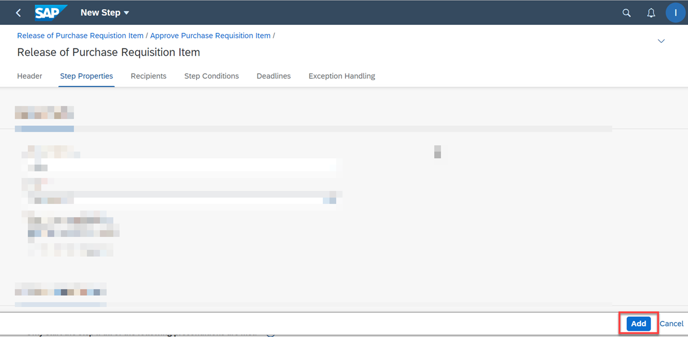
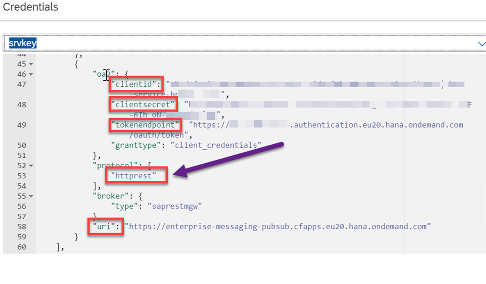
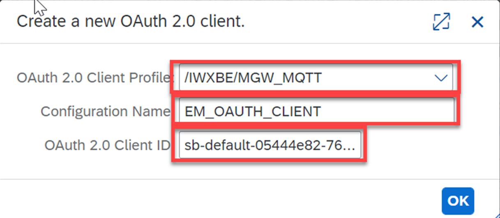
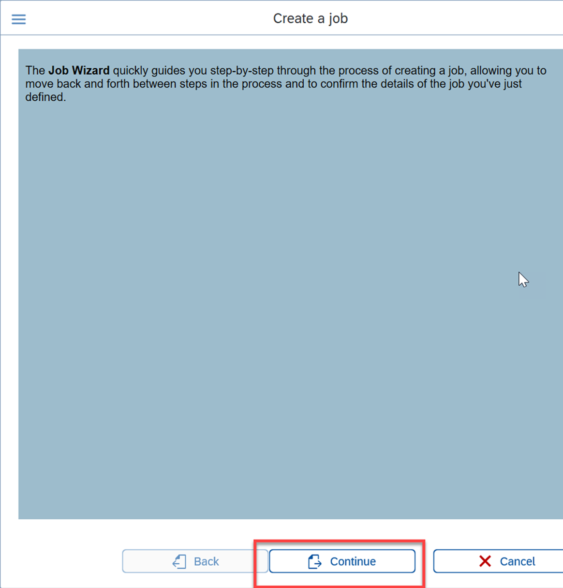
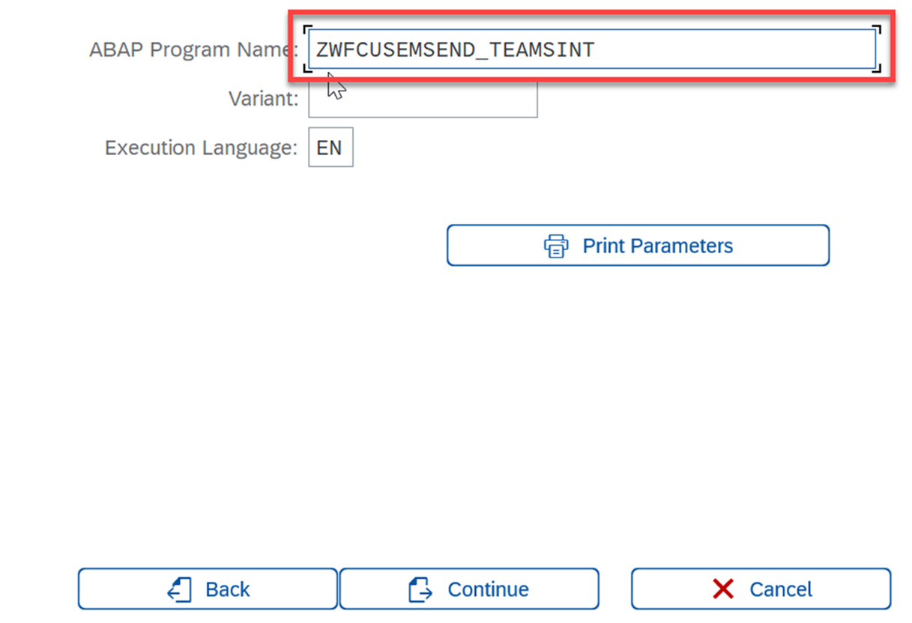
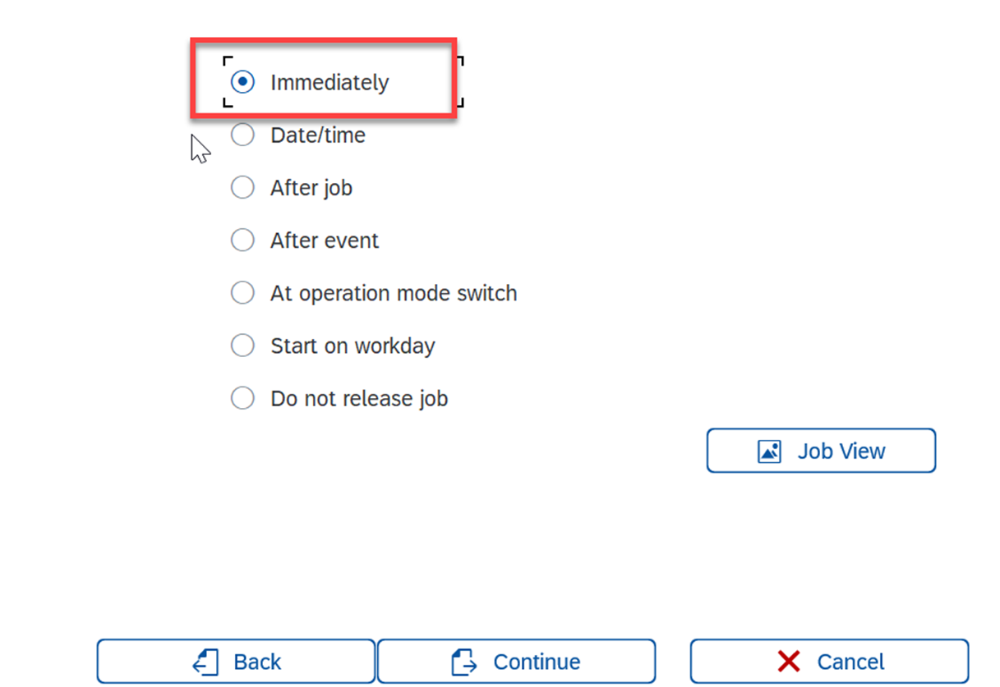

## Configure SAP S/4HANA For Business Scenario
In this section, you will configure the purchase requisition flexible workflow and create a background job. This background job reads all the generated workflow instances and sends them to the SAP Event Mesh.

### 1. Activate The Flexible Workflow
In this step, you will create a flexible workflow, which will send a request (Workflow instance/Workitem) to an approver when you create a purchase requisition with a net amount greater than or equal to 500 USD in your SAP S/4HANA system.

>Note: This step is optional. If you already have an existing workflow running in your SAP S/4HANA system, you can skip this step. Ensure that you have deactivated the other workflows before creating and activating this new workflow.

1. In your SAP S/4HANA system, open the **Manage Workflow for Purchase Requisitions** SAP Fiori application.
    >Note: Ensure the Role - SAP_BR_BPC_EXPERT is assigned to the user to have the above application accessible.

    For more information, see [Manage Workflow for Purchase Requisitions](https://fioriappslibrary.hana.ondemand.com/sap/fix/externalViewer/#/detail/Apps('F2705')/S20OP).

2. Select **Release of Purchase Requisition Item** from the **Workflows** dropdown menu.

    

3. Choose **Add** to add a new workflow.

    

4. Provide a unique name to the workflow.

    

5. Select **Net amount is equal to or greater than** from the dropdown menu and enter **500 USD** for the amount.

    >Note: This step ensures that this workflow will be triggered only if the **Net Amount** of the Purchase Requisition is greater than or equal to **500 USD**.

6. Choose **Add** in the **Step Sequence** section to add the approval step.

7. Select **Release of Purchase Requisition Item** from the step type dropdown menu.

8. Navigate to the **Recipients** section, select **User** from **Assignment By** dropdown menu, and provide a user ID in the **User** field to determine which user the approval should go to. 
    >Note: This user ID needs to have the same email address as the test user created in Azure Active Directory. Go to the user administrator in SAP S/4HANA and update the user's email address.

    

9. Choose **Add** to save this step. The page will then automatically navigate to the previous page.

    

10. Choose **Save**.

    

11. Choose **Activate**.
    >Note: Without this step, your workflow will not be triggered.

    

You have now successfully created and activated the new Flexible Workflow.

### 2. Test The Purchase Requisition Workflow
In this step, you will create a purchase requisition and check if the workflow is triggered in your SAP S/4HANA system.

1. In your SAP S/4HANA system, open the **Manage Purchase Requisition Professional** SAP Fiori application.
    >Note: Ensure the Role - SAP_BR_PURCHASER is assigned to the user to have the above application accessible.
    [**SAP Help - Manage Purchase Requisition Professional**](https://fioriappslibrary.hana.ondemand.com/sap/fix/externalViewer/#/detail/Apps('F2229')/S22OP)

2. Choose **Create** to create a new purchase requisition.

    

3. Add an purchase requisition item with a net amount greater than or equal to 500 USD and choose **Create**.

4. In your SAP S/4HANA system, open the **SWIA** transaction and choose **Execute(F8)** icon. This will show the newly created workitem in the list with the **Dialog Step** type. Copy the value of the **Task** field. You will use this value later on.

5. (Optional) You can also open the **My Inbox** SAP Fiori application in your SAP Fiori Launchpad using the user configured in step 8 of the **1. Activate The Flexible Workflow** section to see the workflow instance sent to the user's inbox for approval.

You have successfully created a purchase requisition, which created a workflow instance and is sent for approval.

### 3. Create a Service Key for the SAP Event Mesh Service Instance

In this step, you create a service key for the SAP Event Mesh service instance. This service key holds the OAuth client credentials and the REST service URL to communicate with the SAP Event Mesh service.

1. Go to the SAP BTP cockpit, navigate to your subaccount and choose **Services** > **Instances and Subscriptions**.

2. In the **Event Mesh** service instance line, choose the three dots and then choose **Create Service Key**.

3. Provide a name and choose **Create**.

4. Choose **View** to open the service key.

5. Scroll down to the **httprest** protocol and copy the values of the **clientid**, **clientsecret**, **tokenendpoint** and **uri** parameters. You will need these parameters later on.

### 4. Create an RFC Destination in SAP S/4HANA

You will create a destination to maintain the REST URL of the SAP Event Mesh <> to connect and send messages.

1. In your SAP S/4HANA system, open the **SM59** transaction and choose the **Create** icon to create a new destination.

2. In the **Destination** field, enter a unique name for the destination and select **G HTTP Connection to external server** from the **Connection Type** dropdown menu.

3. Go to the **Technical Settings** tab. In the **Host** field, enter the copied value of the **uri** parameter in step 5 of the **3. Create a Service Key for the SAP Event Mesh Service Instance** section without **https://**. In the **Port** field, enter **443**.

    

4. Go to the **Logon & Security** tab and in the **Status of Secure Protocol** section, select the **Active** radio button. Then, select **ANONYM SSL  Client(Anonymous)** from the **SSL Certificate** dropdown menu. Choose **Save**.

5. Choose **Connection Test** to check if the connection to SAP Event Mesh is established successfully.

The result should look like this:

### 5. Configure The OAuth Profile

You will configure the OAuth client, which will be used by the RFC destination that you created in step 2 of the **4. Create an RFC Destination in SAP S/4HANA** section.

1. In your SAP S/4HANA system, open the **OA2C_CONFIG** transaction. This will open a web application in your browser. Choose **Create** to create an OAuth client.

2. In the **Create a new OAuth 2.0 client** pop-up:

    - Select **/IWXBE/MGW_MQTT** from the **OAuth 2.0 Client Profile** dropdown menu. 
    - In the **Configuration Name**  field, enter a unique name for the OAuth client.
    - In the **OAuth 2.0 Client ID** field, enter the copied value of the **clientid** parameter in step 5 of the  value from **3. Create a Service Key for the SAP Event Mesh Service Instance** section.

3. Go to the **Administration** tab and in the **General Settings**, in the **Client Secret** field, enter the copied value of the **clientsecret** parameter in step 5 of the  value from **3. Create a Service Key for the SAP Event Mesh Service Instance** section. 

4. In the **Authorization Server Settings** section, in the **Authorization endpoint** and **Token Endpoint** field, enter the copied value of the **tokenendpoint** parameter in step 5 of the **3. Create a Service Key for the SAP Event Mesh Service Instance** section. In the value, remove /token and add **/authorize** instead. 

    For example,customlogicaa-54uuyxjv.authentication.eu12.hana.ondemand.com/oauth/authorize.

    

5. Scroll down to the **Access Settings** section and select the **Form Fields**, **Header Field** and **Client Credentials** radio buttons.

6. Choose **Save**.

    

### 6. Import the ABAP Git Project

Use the GitHub [ABAP Branch URL ](https://github.com/SAP-samples/btp-msteams-extend-workflow/tree/abap) to import the ABAP Class and Report, which contains the code to send the workflow instances(workitems) to SAP Event Mesh.

1. In your SAP S/4HANA system, open the **SE38** transaction and run the program **ZABAPGIT_STANDALONE**.
    >Note: If this program is not available in the system, follow the [Install ABAP Git](https://docs.abapgit.org/guide-install.html) documentation.
    

2. Choose **New Online** to import the repository.

    

3. In the **GitHub Repository URL** field, enter "https://github.com/SAP-samples/btp-msteams-extend-workflow/". In the **Package** field, enter your choice of package name and in the **Branch** field, enter **abap**. Choose **Create Online Repo** to import the repository.

    

4. Choose **Clone Online Repo** and then choose **pull** to save the repository to your SAP S/4HANA system. 
    >Note: For more information, follow the official [ABAP Git tutorial](https://docs.abapgit.org/guide-online-install.html)
    

### 7. Understand the Code of the ABAP Application

Now that you have imported the code to publish the workitems from SAP S/4HANA system to SAP Event Mesh, let's understand how this code works.

After completing step 4 of the **6. Import The ABAP Git Project** section, a report **ZWFCUSEMSEND_TEAMSINT** and a class **zcl_wfcusemsend_teamsint** are created in your SAP S/4HANA system.

The **ZWFCUSEMSEND_TEAMSINT** report will run and execute the **RUN_EM_JOB** method from the **zcl_wfcusemsend_teamsint** class. The last 1-minute timestamp will be sent as the importing parameter to the method **RUN_EM_JOB**, which will be used to fetch the workitems that were created in the last 1 minute of the report's execution (called from the background job, which is described in the upcoming steps).

Inside the **RUN_EM_JOB** method, the **GET_DELTA_WORKFLOW_INSTANCES** private method will be called to fetch all the workflow instances (workitems) that were created. 

After the execution of the **GET_DELTA_WORKFLOW_INSTANCES** method, the **CONNECT_TO_EM** method will create the HTTP connection instance to SAP Event Mesh, which is explained using the comments in the code.

The **SEND_WORKITEM_TO_EM** method will send the purchase requisition workitems to  SAP Event Mesh when the background job is executed.

### 8. Adjust the Code of the ABAP Application

1. Form the URI value to update it in the **CONNECT_TO_EM** method. This URI depends on wheather you are using a trail or enterprise account in SAP BTP.

    - In case of a trial account, use SAP Event Mesh with the **default** plan. Then, the URI value would look like this: **/messagingrest/v1/queues/PRApproval/messages** where **PRApproval** is your queue name.

    - In case of an enterprise account, use SAP Event Mesh with the **standard plan**. Then, the URI value would look like this: **/messagingrest/v1/queues/orgname%2Fs4%2Ft1%2FPRApproval/messages** where **orgname/s4/t1** is the namespace of the SAP Event Mesh service instance and **PRApproval** is the queue name.

        **Note**: The URI value should always have encoded the fully-qualified queue name.
        For example, if the fully-qualified queue name is **orgname/s4/t1/PRApproval**, then the encoded fully-qualified queue name will be **orgname%2Fs4%2Ft1%2FPRApproval**.

2. In your SAP S/4HANA system, open the **SE24** transaction and in the **Object Type** field, enter **ZCL_WFCUSEMSEND_TEAMSINT** and choose **Change**.

3. Open the **CONNECT_TO_EM** method to update the URI value as formed in step 1.

    

4. Open the **CONSTRUCTOR** method to update the destination, OAuth profile and OAuth configuration parameters.
    
    - Replace the value for **dest_name** with the value of the destination name from step 2 of the **4. Create an RFC Destination in SAP S/4HANA** section.
    - Replace the value for **auth_profile** with the value of the OAuth 2.0 client profile from step 2 of the **5. Configure The OAuth Profile** section.
    - Replace the value for **auth_conf** with the value of the configuration name from step 2 of the **5. Configure The OAuth Profile** section.

    Your configuration should look like this:
    

5. Save and activate the class.

### 9. Create the Background Job

You will configure the **ZWFCUSEMSEND_TEAMSINT** report to run in the background every minute. This sends the newly created workitems from the SAP S/4HANA system to SAP Event Mesh.

1. In your SAP S/4HANA system, open the **SM36** transaction and choose **Job Wizard** to create a new background job.

2. Choose **Continue**.

3. In the **Job Name** field, enter a unique name and choose **Continue**. 

4. Select the **ABAP Program Step** radio button and then choose **Continue**.

5. In the **ABAP Program Name** field, enter **ZWFCUSEMSEND_TEAMSINT** and choose **Continue**.

6. Choose **Continue**.

7. Select the **Immediately** radio button and choose **Continue**.

8. Select the **Period** checkbox.

9. Select the **None of the above** radio button and choose **Other periods**.

10. Enter **1** in **Minute(s)** input field, so the background job will run for every 1 minute. Choose **Create**.

11. Choose **Complete** to schedule the background job.

You have now created the background job that sends the newly created workitems to SAP Event Mesh every 1 minute.

### 10. Test the Application End-to-End from the SAP S/4HANA Side
Let's create a new purchase requisition and go to SAP Event Mesh to see the message details.

1. Repeat steps 1, 2, and 3 of the **2. Test The Purchase Requisition Workflow** section to create a new purchase requisition and initiate a new approval workflow. The background job will send the workitem information to SAP Event Mesh queue in a minute.

2. Open the SAP Event Mesh application from the SAP BTP cockpit. For more information, refer to the **2. Set Up SAP Event Mesh** section in [Step1-Configure-SAP-BTP](../Step1-Configure-SAP-BTP//README.md).

3. Choose **Message Clients**, select the message client you have created and go to the **Test** tab to consume the message.

4. Select your queue to see the messages sent to it.

5. Choose **Consume** to see the message.

### 11. Activate the API_PURCHASEREQ_PROCESS_SRV Service

1. In your SAP S/4HANA system, open the **/n/IWFND/MAINT_SERVICE** trasaction.

2. Activate the API_PURCHASEREQ_PROCESS_SRV service.

Now you have the new Flexible workflow for the purchase requisition process created, and you have configured the background job to send the workitems to SAP Event Mesh.