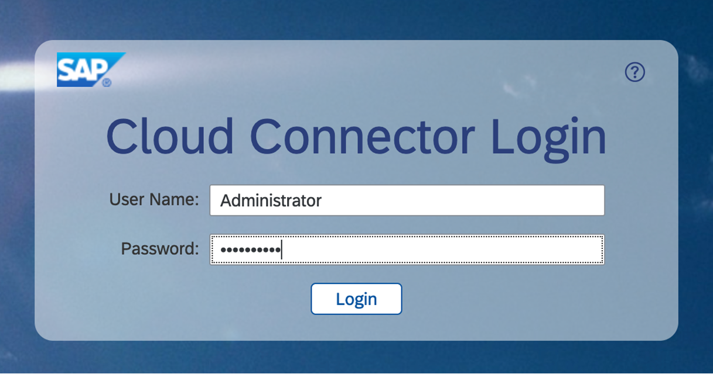

# Connect SAP BTP and SAP S/4HANA using SAP BTP Connectivity Service

Follow these steps to set up Cloud Connector and SAP Connectivity service to establish secured communication between SAP BTP and SAP S/4HANA. 

### 1. Download and Install SAP Cloud Connector 

1. The Cloud Connector can be downloaded from [SAP Development Tools](https://tools.hana.ondemand.com/#cloud). If Java is not installed on the server, download and install Java.

    

    You can download the installable for your operating system. 
    
    You need administrator access to install the Cloud Connector. 

2. Run the installation package and follow the on-screen installation guide. If the installation is successful, the  Cloud Connector will be started automatically.

### 2. Configure Cloud Connector 

1. To configure the Cloud Connector, open https://hostname:port, replace "hostname" with the hostname of the machine on which the cloud connector is installed, and the "port" with the port number mentioned during installation. The default port number is 8443.

    

    Enter below credentials (case sensitive) and choose Login.

    Username: **Administrator** 
    Password: **manage**

    **Note**: The first time you log in, you must change the password and choose Master as the installation type. Click **Save**.

2. Log in to SAP BTP cockpit, navigate to your subaccount and choose **Overview**. In the **General** tab, copy the value of **Subaccount ID**.

    

3. Log in to Cloud Connector Administration cockpit and choose **Add Subaccount**.

    

    In the **Region** field, select your subaccount region.
    
    In the **Subaccount** field, enter the value you copied from the previous step for **Subaccount ID**.

    In the **Display Name** field, enter a unique name of your choice.

    In the **Login E-Mail** and **Password** field, enter the SAP BTP Global Administrator's email id and password.

    Your configuration should look like this:
    

    Choose **Save**.

    **Note**: The following entries are mandatory:

    | key | value |
    | --- | --- |
    | Region | The region you were you SAP BTP subaccount is created.|
    | Subaccount | Your SAP BTP Subaccount ID.|
    | Login E-Mail | Global Administrator's e-mail address which was used when creating the SAP BTP subaccount.|
    | Password | Password of the Global Administrator user ID.|

    Choose **Save**.

### 3. Create Cloud to on-premise Connection

To make SAP S/4HANA system available to SAP BTP services and applications, you need to create a mapping between the Cloud Connector and SAP S/4HANA system.

1. Log in to the Cloud Connector Administration cockpit and choose the name of your subaccount in SAP BTP in **Subaccount** field.

2. Choose **Cloud To On-Premise**. In the **ACCESS CONTROL** tab, choose the **Add** icon to add a virtual host entry under **Mapping Virtual To Internal System**.

    1. In the **Back-end Type** field, select **ABAP System** from the dropdown menu.

    2. In the **Protocol** field, select **HTTPS** from the dropdown menu.
    3. In the **Internal Host** and **Internal Port** fields, enter the hostname or ip address of the SAP S/4HANA system and the corresponding ICM port respectively.

    4. In the **Virtual Host** and **Virtual Port** fields, enter the hostname of your choice and **443** respectively. The value for Virtual Port name can be updated if required.

    5. In the **Principal Type** field, select **X.509 Certificate (Strict Usage)** from the dropdown menu.

    6. In the **Host In Request Header** field, select **Use Virtual Host** from the dropdown menu.
    
    7. In the **Summary**, select **Check Internal Host** and choose **Finish**.

3. Select the virtual host created in the previous step and under **Resources** section , choose **Add** icon.

    1. In the **URL Path** field, enter **/**.
    2. Select the **Active** field.
    3. In the **Access Policy** field, select **Path and All Sub-Paths** radio button.
    4. Choose **Save**. 
  
4.  Your configuration should look like this:
   

5. Navigate to your subaccount in SAP BTP. Choose **Connectivity** > **Cloud Connectors**. You should see the cloud connector configurations in **Connected** state as shown in the screenshot. 

    

### 4. Set Up Principal Propagation

Principal propagation enables the transmission of the message's user context from the sender to the receiver while maintaining its integrity. 

There are two different levels of trust that can be set. The Cloud Connector must first authenticate itself using the system certificates for HTTPs. In order to forward a transient X.509 certificate, we secondly need to permit this identity to spread appropriately. We then map the user in the destination system, in this case the SAP S/4HANA system. 

Information about the logged in cloud user is contained in the subject of the X.509 certificate, and this information is used to map the user to the equivalent user in the target system.

Before you continue, read the blog posts which explains how to setup principal propogation.

[Setting up Principal Propagation](https://blogs.sap.com/2021/09/06/setting-up-principal-propagation/).

[Principal Propagation in multi-cloud solution](https://blogs.sap.com/2020/10/01/principal-propagation-in-a-multi-cloud-solution-between-microsoft-azure-and-sap-cloud-platform-scp-part-ii).

Follow the steps to configure the following certificates in Cloud Connector:

1. Generate **System Certificate** in Cloud Connector

    1. Log in to Cloud Connector Administration cockpit, choose **Configuration**. Go to the **ON PREMISE** tab and choose the **Create and import a self-signed certificate** icon.

        

    2. In the **Common Name (CN) field, enter a name of your choice and choose **Create**.
    
        The Common Name(CN) represents the server name protected by the SSL certificate. The request hostname must match the certificate common name for a valid certificate.

        Fill the details for other fields in **Subject DN** if required.

        

    3. Download the generated certificate by choosing the     **Download certificate in DER format** icon.

        The downloaded sys_cert.der certificate will be used in the steps below. It will be uploaded to  the SAP S/4HANA system (STRUST).

        

2. Generate **CA Certificate** in Cloud Connector.

    A CA certificate signs all the certificates that are used when a request is forwarded from SAP BTP with the cloud principles.

    The Cloud connector acts as a CA when the request is sent from the SAP BTP to SAP S/4HANA system. Every request from the SAP BTP will be signed from Cloud Connector with this certificate. SAP S/4HANA must trust this certificate to establish the communication from cloud to the on-premise system.

    1. To create the CA certificate, scroll down in the **ON PREMISE** tab and choose **Create and import a self-signed certificate** icon.

        

    2. In the **Common Name (CN)** field, enter a name of your choice.Fill the details for other fields in **Subject DN** if required.
    
         
      
    3. Choose **Create**.

3. Create **User Certificate** in Cloud Connector.

1. To create the User certificate, scroll down to Principal Propogation section in the **ON PREMISE** tab and choose **Edit** icon to edit the Subject Pattern.

    

2. In the **Common Name(CN)** field, selct ${email} from the drop down menu to assert the user IDs. For example, Select ${mail} to assert the user against the user’s e-mail address propagated from the cloud.

3. Make sure **Expiration Tolerance (h)** field have a value of **2** and **Certificate Validitity (min)** field has a value of **60**. If these values are empty, you can update the values as required. 
    

    Note: You can select the Subject Pattern depending on the assertion attribute. You can also provide manual pattern if it is not listed in the dropdown. For example, ${email}.

3. Choose **Save**.

4. Once the certificate is created, choose **Create a sample certificate** icon.

    

    You will be asked for user credentials before downloading, enter the test user credentials that you created in Microsoft Active Directory.

    
    
5. This sample certificate is used to define the rules in the SAP S/4HANA system. Open **CERTRULE** transaction, enter the same email ID and choose **Generate**.

    

    This will download the sample certificate.

### 6. Synchronize the Cloud Subaccount IDP

   In your Cloud Connector Administration cockpit, choose **Cloud To On-Premise**. Go to the **PRINCIPAL PROPOGATION** tab and choose **Synchronise** icon to sync the trust configuration details of the connected subaccount in SAP BTP.
  
  You should be able to see the below entry in your **Trust Configuration** table.

  

### 7. Configure SAP S/4HANA with Certificates for the Principal Propagation 

1. **Import the System Certificate**

    1. In your SAP S/4HANA system, go to **STRUST** transaction.

        Expand **SSL Server Standard** and go to the Instance Specific. If there is no existing SSL Server Standard, switch to the edit mode and right click on the SSL Server standard to create one.

        

    2. Choose **Import Certificate** to import the system certificate that you downloaded from the Cloud Connector (sys_cert.der).

    3. Choose **Add to Certificate list** to add the certificate to the list of trusted certificates.

        

2. Define the Rule-based Mapping

    1. Open **CERTRULE** transaction.

    2. Choose **Import Certificate** to import the sample certificate (scc_sample_cert.der) that was downloaded from the Cloud Connector.

        Choose **Rule** to map the rules.

        

    3. In the **Certificate Entry** field, select **Subject** from dropdown menu.

    4. In the **Certificate Attr** field, select the certificate from the dropdown menu.

    5. In the **Login As** field, select **E-Mail** from the dropdown menu.  

        

    6. Choose **Save**.

        

3. **Maintain Profile Parameters**

    1. Go to the **RZ10** transaction in your SAP S/4HANA system.

    2. In the **Profile** field, enter **DEFAULT** and in the **Edit Profile** select **Extended Maintenance**. 

    3. Choose **Change**.

        

    4. Choose **Parameter** to add new parameter.

        

        In the **Parameter Name** field, enter **icm/trusted_reverse_proxy_0** and value as **SUBJECT=”CN=<>”, ISSUER=”CN=<>**.

        Copy these values from the Cloud Connector System Certificate in step 4.

    5. Choose **Copy**.

        

    6. Go back and choose **Save** and activate the DEFAULT profile.     

        

        You can ignore the error check validations at this point.

4. **Restart the ICM** 

    Open **SMICM** transaction.

    Go to **Administration** > **ICM** > **Exit Soft** > **Global** to restart the ICM to reflect the changes related to the PROFILES and parameters.

    

### 8. Create Destination in SAP BTP subaccount

1. n the SAP BTP cockpit, log in with admin user credentials. 

2. Navigate to you subaccount and choose **Connectivity** > **Destinations**. 

3. Choose New **Destinations**.

4. Enter the following configuration values to create destination for principal propagation.

    | key | value |
    | --- | --- |
    |  Name | S4HANA_PP |
    |   Type | HTTP |
    |  URL | The virtual host and port, e.g. http://virtualhostname:44300 |
    |  Proxy Type | OnPremise |
    |  Authentication | PrincipalPropagation |

    Add additional properties:

    | key | value |
    |  --- | --- |
    |  sap-client | your client no |
    |  HTML5.DynamicDestination | true |
    |  WebIDEEnabled | true |
    | WebIDEUsage | odata_abap |

5. Enter the following configuration values to create destination for basic authentication.

   | key | value |
   | --- | --- |
   | Name | S4HANA_NP |
   | Type | HTTP |
   | URL | The virtual host and port, e.g. http://virtualhostname:44300 |
   | Proxy Type | OnPremise |
   | Authentication | BasicAuthentication |
   | User| Technical User |
   | Password| Technical User Password | 

    Add additional properties:

    | key | value |
    | --- | --- |
    | sap-client | your client no |
    | HTML5.DynamicDestination | true |
    | WebIDEEnabled | true |
    | WebIDEUsage | odata_abap |

**Note:** The destination name is hardcoded in the application. If you change the name of the destination here, you have to change the code as well in S4HANAClient.js file.

Apart from this, there are a few changes required to be done in ApprovalDialog.js based on the type of Authentication method selected which is explained in the code.
