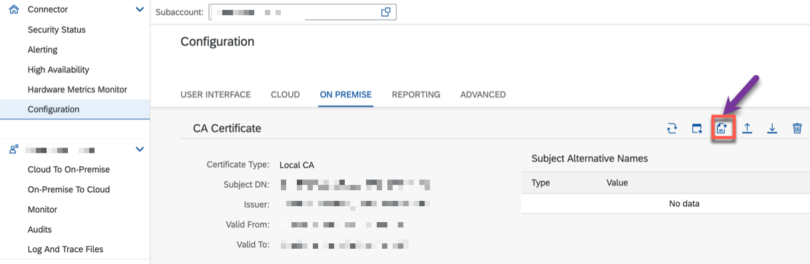

# Connect SAP S/4HANA using SAP BTP Connectivity Service

## Prerequisites

**SAP S/4HANA on Azure**

**SAP Business Technology Platform**

- Cloud Foundry Subaccount
    
    - Foundation for running the MS Teams extension application.
    - Required for Azure AD - SAP BTP Trust Configuration
    - Required to connect to  SAP S/4HANA using SAP Cloud connector
    
- Connectivity Service
    
    - Required to establish connectivity between SAP S/4HANA and a SAP BTP application.
    
- Destination Service
    
    - Required to consume SAP S/4HANA API or ODATA service using SAP BTP application.

### 1. Download and install SAP Cloud Connector 

1. The SAP Cloud Connector can be downloaded from [this link](https://tools.hana.ondemand.com/#cloud). If Java is not installed on the server, it is required to install Java.

    

    You can download the zip archive for your operating system. You need administrator access to install the SCC on an on-premise server. 

2. Run the installation package and follow the on-screen installation guide. If the installation is successful, the SAP Cloud Connector is started automatically.

### 2. Configure SAP Cloud Connector 

1. To configure the SAP Cloud Connector, enter https://hostname:port in a browser, where "hostname" is the hostname of the machine on which the connector is installed, and the "port" is the port number configured during installation. The default port number is 8443.

    

    Enter below default credentials (case sensitive) and click on Login:

    Username: **Administrator** \
    Password: **manage**

    **Note**: The first time you log in, you must change the password and choose Master as the installation type. Click on Save.

2. Choose **Add Subaccount** and provide information of your SAP BTP so we you configure a secure tunnel between the SCC and SAP BTP.

    

    Go to SAP BTP cockpit, copy your subaccount from below 

    Login Em-Mail - enter the global admin role..

    add screenshot .

    

    The following entries are mandatory:

    | key | value |
    | --- | --- |
    | Region | The region you were you subaccount is created |
    | Subaccount | Your subaccount ID |
    | Login E-Mail | E-mail addressed used when creating the SAP BTP account |
    | Password | Password used when creating the SAP BTP account |

    Choose **Save**.

### 3. Create Cloud to on-premise Connection

To make a on-premise resource available to the services on the SAP Business Technology Platform subaccount we first need to create a mapping between the SCC and the on-premise system.

1. In the SCC admin cockpit firstly make sure you select the right one in case you have created more than one subaccount , click on “Cloud to On-premise” in the menu on the left followed by a click on the “+” sign to the right. This will open the guide for adding mappings.Follow the wizard which opens up to create a HTTPS mapping.

    choose the subaccount 
    left panel 
    cloud to on-premise + sign

2. Select the **Back-end Type** as "ABAP System". dropdown

3. Select the **Protocol** as "HTTPS". doprdown

4. **Internal Host** is the hostname or ip address of the SAP S/4HANA backend system and the corresponding ICM port--- field

5. **Virtual Host** is the host name you will be using in the SAP BTP, you can select the default value which are the same as the Internal Host or select another less revealing name. -- field..

6. Select **Principal Type** as "X.509 Certificate (Strict Usage)". dropdown 

7. Lastly you get a summary of the entered data and if you select the **Check Internal Host** which will perform a simple check to verify that the mapping is working. checkbox.

8. Next, we need to add resources to the mapping i.e., services from the backend Select the newly created mapping and click the "+" sign just below to add resources. we make all services available to the subaccount by entering / in the URL path and select **Path And All Sub-Paths** under Access Policy.

As soon as Cloud connector setup is complete you able to see it in your SAP BTP Account.
navigate to **Connectivity** ... path and 

### 4. Set Up Principal Propagation

Read the below blog posts which explains how to setup Principal Propogation as well.
[Setting up Principal Propagation](https://blogs.sap.com/2021/09/06/setting-up-principal-propagation/)

[Principal Propagation in multi-cloud solution](https://blogs.sap.com/2020/10/01/principal-propagation-in-a-multi-cloud-solution-between-microsoft-azure-and-sap-cloud-platform-scp-part-ii)

Principal propagation enables the transmission of the message's user context from the sender to the receiver while maintaining its integrity. 

There are two different levels of trust that can be set. The Cloud Connector must first authenticate itself using the system certificates for HTTPs. In order to forward a transient X.509 certificate, we secondly need to permit this identity to spread appropriately. We then map the user in the destination system, in this case the on-premises SAP S/4HANA system. 

Information about the Cloud user is contained in the subject of the X.509 certificate, and this information is used to map the user to the equivalent user in the target system.
We have to configure the following certificates in Cloud Connector:

1. Generate **System Certificate** in Cloud Connector

    1. **System Certificate**
    To configure the System Certificate, go to Configuration → On Premise → System Certificate and choose **Create and import a self-signed certificate** icon.

    

    2. Fill the required details in the pop-up window. The Common Name (CN) represents the server name protected by the SSL certificate. The request hostname must match the certificate common name for a valid certificate.

    CN : name of your choice. 
    

    3. Chooose **Create**.

    3. Download the generated certificate

    **Download certificate in DER format** icon

    The downloaded sys_cert.der certificate will be used in the steps below. It will be uploaded to  the SAP S/4HANA on-premise backend system (STRUST).

    

2. Generate **CA Certificate**

    A CA certificate  signs all the certificates that are used when a request is forwarded from the Cloud with the Cloud principals.

    1. To create the CA certificate, scroll down to the corresponding section and click on the **Create and import a self-signed certificate** button.

    Common Name - name of your choice.

    

    2. Fill the required details in the pop-up window to generate the certificate.

    

    CA - Certificate Authority.

    The Cloud connector acts as a CA when the request is sent from the SAP BTP to SAP S/4HANA on-premise system. Every request from the SAP BTP will be signed from Cloud Connector with this certificate. SAP S/4HANA must trust this certificate to establish the communication from cloud to the on-premise system.

    3. Choose Create

3. Create **User Certificate**

    1. Scroll down to the Principal propagation section and edit the Subject Pattern

    

    2. Select the ${email} from the drop donw for the field - Common Name(CN) Subject Pattern from the list to assert the user IDs. For example, Select ${mail} to assert the user against the user’s mail address propagated from the Cloud.

    Make sure Expirtation tolencence and certificate validatity field is updated.else enter.

    

    Note: You can select the Subject Pattern depending on the assertion attribute. You can also provide manual pattern if it is not listed in the dropdown. For example, ${email}.

    3. Choose Save.

    4. click on the **Create a sample certificate** icon

    pop up will ask for user credentials. this user credentials is the 

    add screenshot. createsamplecert.

    

    **Note :** Please use your test user while creating the sample certificate.
    test user created in Azure Active Directory.

    This sample certificate is used to define the rules in the SAP S/4HANA On-premise system under the Transaction code (CERTRULE).

    

    5. Chooose **Generate**. This will download the sample certificate.

### 6. Synchronize the Cloud Subaccount IDP

   Go to Cloud To On-Premise → Principal Propagation tab. Click on the **Synchronise** icon to sync the Trust Configuration details of the connected subaccount in SAP BTP.

  

### 7. Configure SAP S/4HANA Backend System with Certificates for the Principal Propagation Setup

1. **Import the System Certificate**

    1. Go to the transaction code STRUST
    Expand the SSL Server Standard and go to the Instance Specific as shown in the below image. If there is no existing SSL Server Standard, switch to the edit mode and right click on the SSL Server standard to create one.

    

    2. Click on the Import Certificate button to import the System certificate downloaded from the Cloud Connector (sys_cert.der).

    3. Click on “Add to Certificate list” to add the certificate to the list of trusted certificates.

    

2. Define the Rule-based Mapping**

    Go to the transaction code CERTRULE.
    Click on the “Import Certificate” button to import the Sample certificate (scc_sample_cert.der) that was downloaded from the Cloud Connector in section 1.3.

    

    Click on the Rule button to map the rules.

    

    Choose the Certificate Attr and login as E-Mail (or user name as per the requirement).
    You can view the Status after a Save.

    

3. **Maintain Profile Parameters**

    Go to the transaction RZ10
    Choose Profile DEFAULT and then Edit button for Extended Maintenance.

    

    Click on New Parameter button

    

    Give the Parameter name as “icm/trusted_reverse_proxy_0” and value as

    SUBJECT=”CN=<>”, ISSUER=”CN=<>”.

    You can copy these values from the Cloud Connector System Certificate section (1.1).

    After filling the values, click on Copy.

    

    Go back and Save parameter. Activate the DEFAULT profile.

    

    You can ignore the error check validations at this point.

4. **Restart the ICM** 

    Go to the transaction SMICM.
    You can restart the ICM to reflect the changes related to the PROFILES and parameters.
    Go to Administration → ICM → Exit Soft → Global.

    

## SAP Destination Creation

1. Open the SAP BTP Cockpit in your browser and log in with your account admin.
Navigate to your trial account and select **Connectivity** –  **Destinations** from the left side navigation menu.
2. Click New **Destination**.

3. Enter the following configuration values:  
**For Principal Propagation**

| key | value |
| --- | --- |
  |  Name | S4HANA_PP |
 |   Type | HTTP |
  |  URL | The virtual host and port, e.g. http://virtualhostname:44300 |
  |  Proxy Type | OnPremise |
  |  Authentication | PrincipalPropagation |

**Additional Properties**

  | key | value |
  |  --- | --- |
  |  sap-client | your client no |
  |  HTML5.DynamicDestination | true |
  |  WebIDEEnabled | true |
  | WebIDEUsage | odata_abap |

4. **For Basic Authentication**

   | key | value |
   | --- | --- |
   | Name | S4HANA_NP |
   | Type | HTTP |
   | URL | The virtual host and port, e.g. http://virtualhostname:44300 |
   | Proxy Type | OnPremise |
   | Authentication | BasicAuthentication |
   | User| Technical User |
   | Password| Technical User Password | 

**Additional Properties**

   | key | value |
   | --- | --- |
   | sap-client | your client no |
   | HTML5.DynamicDestination | true |
   | WebIDEEnabled | true |
   | WebIDEUsage | odata_abap |

**Note:** The destination name is hardcoded in the application. If you change the name of the destination here, you have to change the code as well in S4HANAClient.js.
Apart from this, there are a few changes required to be done in ApprovalDialog.js based on the type of Authentication method selected.