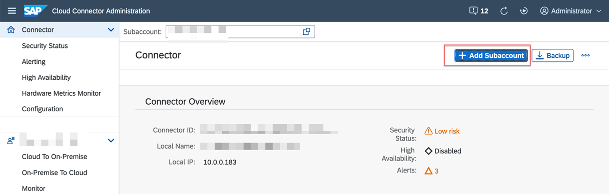
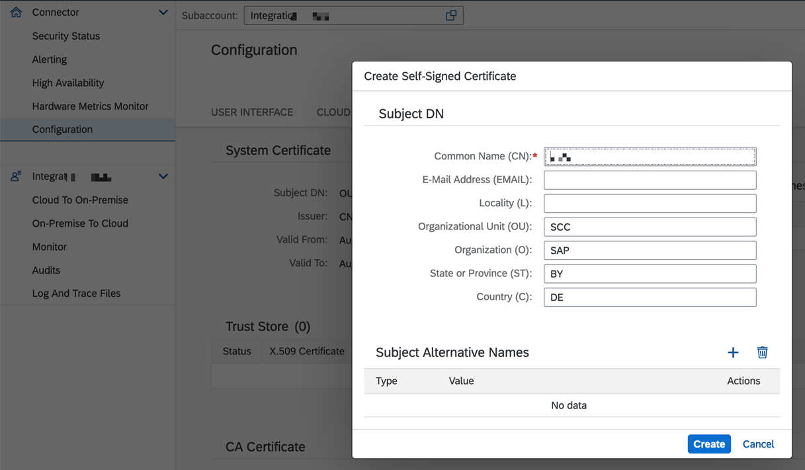

# Connect SAP BTP and SAP S/4HANA Using SAP BTP Connectivity Service

Follow these steps to set up the Cloud Connector and the SAP Connectivity service to establish secured communication between SAP BTP and SAP S/4HANA. 

### 1. Download and Install the Cloud Connector 

1. Download the Cloud Connector from [SAP Development Tools](https://tools.hana.ondemand.com/#cloud) for your operating system. If you don't have Java installed on the server, download and install it.

    

    You need an administrator access to install the Cloud Connector. 

2. Run the installation package and follow the on-screen installation guide. If the installation is successful, the  Cloud Connector will be started automatically.

### 2. Configure the Cloud Connector 

1. To configure the Cloud Connector, open https://hostname:port, replace **hostname** with the hostname of the machine on which the Cloud Connector is installed, and the **port** with the port number mentioned during the installation. The default port number is 8443.

    

    Enter below credentials (case sensitive) and choose Login.

    Username: **Administrator** 
    Password: **manage**

    **Note**: The first time you log in, you must change the password and choose Master as the installation type. Click **Save**.

2. Log in to SAP BTP cockpit, navigate to your subaccount and choose **Overview**. In the **General** tab, copy the value of **Subaccount ID**.

    

3. Log in to Cloud Connector Administration cockpit and choose **Add Subaccount**.

    

    1. In the **Region** field, select your subaccount region.
    
    2. In the **Subaccount** field, enter the value of the subaccount ID you copied in the previous step.

    3. In the **Display Name** field, enter a unique name of your choice.

    4. In the **Login E-Mail** and **Password** fields, enter the Global Account Administrator's email ID and password.

    Your configuration should look like this:
    

    5. Choose **Save**.

### 3. Create a Cloud to On-Premise Connection

To make the SAP S/4HANA system available to the services and application in SAP BTP, you need to create a mapping between the Cloud Connector and the SAP S/4HANA system.

1. Log in to the Cloud Connector Administration cockpit and choose the name of your subaccount in SAP BTP in the **Subaccount** field.

2. Choose **Cloud To On-Premise**. In the **ACCESS CONTROL** tab, in the **Mapping Virtual To Internal System** section, choose the **Add** icon to add a virtual host entry.

    1. In the **Back-end Type** dropdown menu, select **ABAP System**. Choose **Next**.

    2. In the **Protocol** dropdown menu, select **HTTPS**. Choose **Next**.

    3. In the **Internal Host** and **Internal Port** fields, enter the hostname or IP address of the SAP S/4HANA system and the corresponding ICM port. Choose **Next**.

    4. In the **Virtual Host** and **Virtual Port** fields, enter a hostname of your choice and the **443** port. The value for virtual port can be updated if required. Choose **Next**.

    5. In the **Principal Type** dropdown menu, select **X.509 Certificate (Strict Usage)**. Choose **Next**.

    6. In the **Host In Request Header** dropdown menu, select **Use Virtual Host**. Choose **Next**.
    
    7. Select the **Check Internal Host** checkbox and choose **Finish**.

3. Select the virtual host created in the previous step and in the **Resources** section, choose the **Add** icon.

    1. In the **URL Path** field, enter **/**.
    2. Select the **Active** field.
    3. In the **Access Policy** field, select the **Path and All Sub-Paths** radio button.
    4. Choose **Save**. 
  
4.  Your configuration should look like this:
   

5. In SAP BTP cockpit, navigate to your subaccount. Choose **Connectivity** > **Cloud Connectors**. The state of the Cloud Connector configurations should be **Connected**.

    

### 4. Set Up the Principal Propagation

The principal propagation enables the transmission of the user context from the sender to the receiver while maintaining its integrity. 

There are two different levels of trust that can be set. The Cloud Connector must first authenticate itself using the system certificates for HTTPs. In order to forward a transient X.509 certificate, you need to allow this identity to spread appropriately. Then, map the user in the target system, in this case the SAP S/4HANA system. 

Information about the user who is logged in contained in the subject of the X.509 certificate, and this information is used to map the user to the equivalent user in the target system.

Before you continue, read the blog posts which explains how to set up principal propogation:

- [Setting up Principal Propagation](https://blogs.sap.com/2021/09/06/setting-up-principal-propagation/).

- [Principal Propagation in multi-cloud solution](https://blogs.sap.com/2020/10/01/principal-propagation-in-a-multi-cloud-solution-between-microsoft-azure-and-sap-cloud-platform-scp-part-ii).

Follow these steps to configure the certificates in the Cloud Connector:

1. Generate a system certificate in the Cloud Connector:

    1. Log in to the Cloud Connector Administration cockpit and choose **Configuration**. Go to the **ON PREMISE** tab and choose the **Create and import a self-signed certificate** icon.

        

    2. In the **Common Name (CN)** field, enter a name of your choice and choose **Create**.
    
        The Common Name(CN) represents the server name protected by the SSL certificate. The request hostname must match the certificate common name for a valid certificate.

        Fill in the details for the other fields in the **Subject DN** section if required.

        

    3. Download the generated certificate by choosing the     **Download certificate in DER format** icon.

        The downloaded **sys_cert.der** certificate will be used in the steps to follow.

        

2. Generate a Certificate Authority(CA) certificate in Cloud Connector.

    A CA certificate signs all the certificates that are used when a request is forwarded from SAP BTP with the cloud principles.

    The Cloud Connector acts as a Certificate Authority(CA) when the request is sent from SAP BTP to the SAP S/4HANA system. Every request from SAP BTP will be signed from the Cloud Connector with this certificate. The SAP S/4HANA system must trust this certificate to establish the communication from the cloud to the on-premise system.

    1. To create the CA certificate, scroll down in the **ON PREMISE** tab and choose the **Create and import a self-signed certificate** icon.

        

    2. In the **Common Name (CN)** field, enter a name of your choice.Fill in the details for the other fields in the **Subject DN** section if required.
    
         
      
    3. Choose **Create**.

3. Create a user certificate in the Cloud Connector.

    1. To create a user certificate, scroll down to the **Principal Propogation** section in the **ON PREMISE** tab and choose the **Edit** icon to edit the Subject Pattern.

        

    2. In the **Common Name(CN)** field, select ${email} from the drop down menu to assert the user IDs. For example, Select ${mail} to assert the user against the user’s e-mail address propagated from the cloud.

    3. Make sure **Expiration Tolerance (h)** field has a value of **2** and **Certificate Validitity (min)** field has a value of **60**. If these values are empty, you can update the values as required. 
    

        Note: You can select the Subject Pattern depending on the assertion attribute. You can also provide manual pattern if it is not listed in the dropdown. For example, ${email}.

    4. Choose **Save**.

    5. Once the certificate is created, choose **Create a sample certificate** icon.

        

        You will be asked for user credentials before downloading, enter the test user credentials that you created in Microsoft Active Directory.

        
    
    6. This sample certificate is used to define the rules in the SAP S/4HANA system. Open **CERTRULE** transaction, enter the same email ID and choose **Generate**.

        

        This will download the sample certificate.

### 5. Synchronize the Cloud Subaccount IDP

   In your Cloud Connector Administration cockpit, choose the **Cloud To On-Premise**. Go to the **PRINCIPAL PROPOGATION** tab and choose the **Synchronise** icon to sync the trust configuration details of the connected subaccount in SAP BTP.
  
  You should be able to see the below entry in your **Trust Configuration** table.

  

### 6. Configure SAP S/4HANA with Certificates for the Principal Propagation 

1. Import the System Certificate

    1. In your SAP S/4HANA system, open the **STRUST** transaction.

        Expand **SSL Server Standard** and go to the **Instance Specific**. If there is no existing SSL Server Standard, switch to the edit mode and right click on the SSL Server standard to create one.

        

    2. Choose **Import Certificate** to import the system certificate that you downloaded from the Cloud Connector (sys_cert.der).

    3. Choose **Add to Certificate list** to add the certificate to the list of trusted certificates.

        

2. Define the Rule-based Mapping

    1. Open **CERTRULE** transaction.

    2. Choose **Import Certificate** to import the sample certificate (scc_sample_cert.der) that was downloaded from the Cloud Connector.

        Choose **Rule** to map the rules.

        

    3. In the **Certificate Entry** field, select **Subject** from dropdown menu.

    4. In the **Certificate Attr** field, select the certificate from the dropdown menu.

    5. In the **Login As** field, select **E-Mail** from the dropdown menu.  

        

    6. Choose **Save**.

        

3. Maintain Profile Parameters

    1. Open the **RZ10** transaction in your SAP S/4HANA system.

    2. In the **Profile** field, enter **DEFAULT** and in the **Edit Profile** select **Extended Maintenance**. 

    3. Choose **Change**.

        

    4. Choose **Parameter** to add new parameter.

        

        In the **Parameter Name** field, enter **icm/trusted_reverse_proxy_0** and value as **SUBJECT=”CN=<>”, ISSUER=”CN=<>**.

        Copy these values from the Cloud Connector System Certificate in step 4.

    5. Choose **Copy**.

        

    6. Go back and choose **Save** and activate the DEFAULT profile.     

        

        You can ignore the error check validations at this point.

4. Restart the ICM 

    Open **SMICM** transaction.

    Go to **Administration** > **ICM** > **Exit Soft** > **Global** to restart the ICM to reflect the changes related to the PROFILES and parameters.

    

### 7. Create Destination in SAP BTP subaccount

Follow these steps to create the destinations for basic authentication and principal propogation between Microsoft Teams and the SAP S/4HANA system.

1. Log in to the SAP BTP cockpit with admin user credentials. 

2. Navigate to you subaccount and choose **Connectivity** > **Destinations**. 

3. Create a new destination with the name **S4HANA_PP**.This is used for principal propogation.

    1. Choose **New Destination** and enter the following configuration values.

        | key | value |
        | --- | --- |
        |  Name | S4HANA_PP |
        |   Type | HTTP |
        |  URL | The virtual host and port, e.g. http://virtualhostname:44300 |
        |  Proxy Type | OnPremise |
        |  Authentication | PrincipalPropagation |

    2. Add the additional properties:

        | key | value |
        |  --- | --- |
        |  sap-client | your SAP Client no |
        |  HTML5.DynamicDestination | true |
        |  WebIDEEnabled | true |
        | WebIDEUsage | odata_abap |

4. Create another destination with the name **S4HANA_NP**.This is used for basic authentication.

    1. Choose **New Destination** and enter the following configuration values.

        | key | value |
        | --- | --- |
        | Name | S4HANA_NP |
        | Type | HTTP |
        | URL | The virtual host and port, e.g. http://virtualhostname:44300 |
        | Proxy Type | OnPremise |
        | Authentication | BasicAuthentication |
        | User| Technical User |
        | Password| Technical User Password | 

    2. Add the additional properties:

        | key | value |
        | --- | --- |
        | sap-client | your SAP Client no |
        | HTML5.DynamicDestination | true |
        | WebIDEEnabled | true |
        | WebIDEUsage | odata_abap |

    **Note:** The destination name is hardcoded in the application. If you change the name of the destination here, you have to change the code as well in S4HANAClient.js file.

    Apart from this, there are a few changes required to be done in ApprovalDialog.js based on the type of Authentication method selected which is explained in the code.
