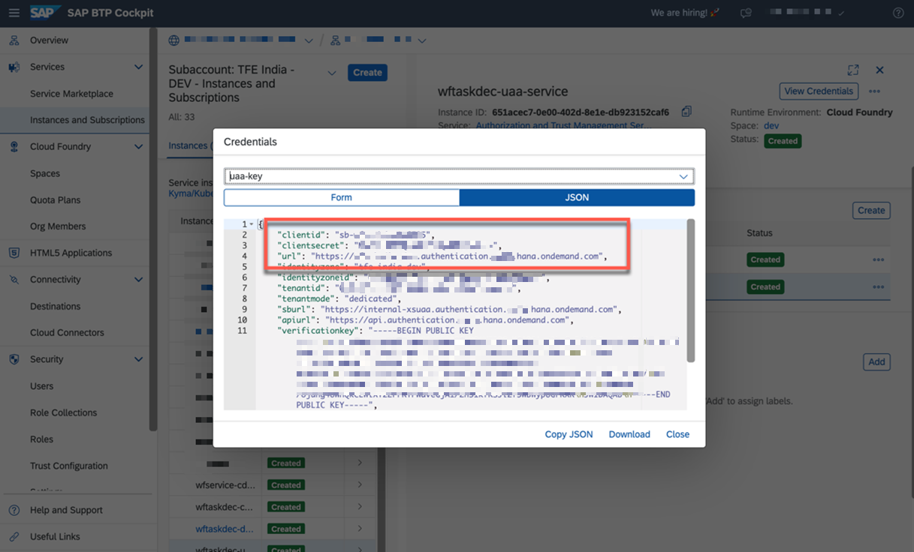

## Build and Deployment of SAP BTP Extension Application.

Let us clone the codebase and deploy the extension application. 

1. Clone [this](https://github.com/SAP-samples/btp-msteams-extend-workflow) GitHub Repository.

    Before deployment to the SAP BTP environment, please make sure that you created an **XSUAA instance** in your BTP subaccount as described as mentioned under **XSUAA Instance** in Section **Step 1 - Configure SAP BTP**.

    Otherwise, the deployment will fail due to the missing binding. In case you changed the name of your XSUAA instance from **wftaskdec-uaa-service** to something else, please adjust the **manifest.yml** file in the deploy folder of this project. 


2. Update manifest.yml and vars.yml files.
   Go to the deploy folder and make sure you fill the sample files in the **deploy** folder and remove the **sample** file extension before you push the app. 

    Rename the manifest.yml.sample to manifest.yml 
    Rename the vars.yml.sample to vars.yml

3. Update the environment variables in vars.yml as shown below.

    ```

    Provide your environment variables in:
    /deploy/vars.yml
    ```

    ### Environment variables
    The following environment variables need to be set before you deploy the application to SAP BTP or upload it to your MS Teams environment.

    **/deploy/vars.yaml**

    | key    | value    |
    | --------|---------|
    |**SCENARIO**| For S/4HANA  on-premise, the value is "onpremise" and for S/4HANA on Azure Private Cloud, use the value "azureprivatecloud". Please follow the below steps to configure additional settings needed for S/4HANA running on [Azure-Private-Cloud](../Azure-Private-Cloud-PrivateLink/README.md)  |
    |**BTP_LANDSCAPE**|The region of your BTP subaccount e.g. eu20|
    |**BTP_ACCOUNT_NAME**|The subdomain of your BTP subaccount|
    |**XSUAA_CS_URL_SUFFIX**|The audience value (e.g., azure-live-eu20 or aws-live-eu10 or aws-live) which can be extracted from the SAML metadata of your SAP BTP subaccount. Make sure you don’t include the subdomain of your SAP BTP subaccount but only use the value after the last period|
    |**BTP_SCOPES**|The full name of the custom scope created in Step 2 Configure-Azure from api:// to /access_as_user|
    |**CONNECTION_NAME_GRAPH**|The name of the Graph connection creates in Step 2 Configure-Azure e.g. GraphConnection|
    |**CONNECTION_NAME_BTP**|The name of the BTP connection creates in Step 2 Configure-Azure e.g. BTPConnection|
    |**MICROSOFT_BLOB_CONTAINER_NAME**|The respective values copied in Step 2 - Configure-Azure|
    |**MICROSOFT_BLOB_CONNECTION_STRING**|The respective values copied in Step 2 - Configure-Azure|
    |**DOMAIN**| The CF domain of your MS Teams extension application e.g. btp-extendworkflow-s4-msteams.cfapps.eu20.hana.ondemand.com |
    |**MICROSOFT_APP_ID**| The Application Client Id of your Azure AD App Registraiton |
    |**MICROSOFT_APP_PASSWORD**|A Client Secret which you created for your Azure AD App Registration|
    |**MICROSOFT_AD_TENANT_ID**|The unique Id of your Azure Active Directory|
    |**SAP_CLIENT**|sap-client number of your S4/HANA system that you are using|


4. Open the manifest.yml file to update the application name. This application name needs to be updated in App Registration Configuration in Microsoft Azure.

    ```console
    Provide your application name in:
    /deploy/manifest.yml
    ```
5. Build and deploy.
    Once you're ready, please execute the following steps manually or by running the respective npm command.

    a) Build your server application

    ```console
    npm install
    ```

    b) Login to your Cloud Foundry subaccount, which you would like to deploy to

    ```
    cf login -a `<CF API endpoint e.g. https://api.cf.eu20.hana.ondemand.com/>`
    ```

    c) Push the application to your dedicated subaccount

    ```
    cd deploy
    cf push -f manifest.yml --vars-file vars.yml
    ```

    Once the application is deployed, note down the Extension Application URL as shown below
     

    You can also check the status of your application in your SAP BTP Cockpit.
     


6. Microsoft Teams manifest upload.

    In this step, you will upload the manifest definition of the extension application to Microsoft Teams.

    Go to folder deploy->msteamsfiles. Rename manifest.json.sample and remove the .sample. 
    In your manifest.json file, the below parameters need to be updated.<br>


    Generate the GUID from command prompt as shown below. 
     

    Once the GUID is generated, update the manifest.json file with the below parameter before you upload the manifest definition of your extension app to Microsoft Teams.

    **/deploy/msteamsfiles/mainfest.json**
    | key    | value    |
    | --------|---------|
    |**msteamsappguid-placeholder**|A unique GUID for the MS Teams App. It can be generated using Windows PowerShell by invoking the command [guid]:: NewGUID. This GUID is for the MS Teams environment only and does not equal the Application Registration Client Id.|
    |**msappid-placeholder**|Azure App Registration Client ID of your extension application.|
    |**domain-placeholder:**|The CF domain of your MS Teams extension.|

    Your manifest.json file should reflect the below changes
     

     

    Once you have the configuration parameters updated, you must zip all files in the /deploy/msteamsfiles folder.
     

    Now, we need to upload this to [Microsoft Teams Admin Center](https://admin.teams.microsoft.com/). Login with an Active Directory user who has a Microsoft Teams Administrator role assigned.

    Use the menu as shown below to upload your app.
     

    Once the upload is successful, you should be able to see the extension application in the Build for your org Section within Microsoft Teams, as shown below.
    Login to https://teams.microsoft.com and check the App Store.
     


## Post Deployment Steps

**Configure webhook to receive notifications from SAP S/4HANA via SAP Event Mesh**

1. Go to SAP BTP Cockpit. Go to the Subaccount - Services - Instances and Subscriptions. 
2. Click on the instance for uaa service "wftaskdec-uaa-service" and create a Service key.


3. Notedown the service key details created in the above step.


4. Click on the instance for Event Mesh. As this is executed in a trial environment, you will see the plan as a dev for SAP Event Mesh Service.


5. Create webhook as shown below
   Enter the respective values copied from from step 3 for Client ID and Client Secret.
   For Token URL, enter the value as <url from step3>/oauth/token


6. If the subscription status is paused, then click on resume subscription.

This completes the deployment of the SAP BTP Extension application and the webhook configuration. 
Now, let us go ahead and test the application.
