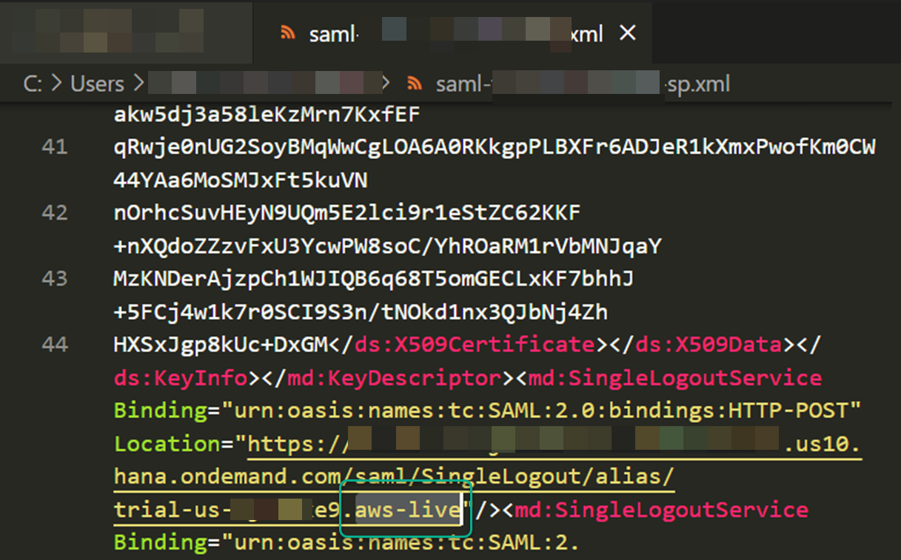
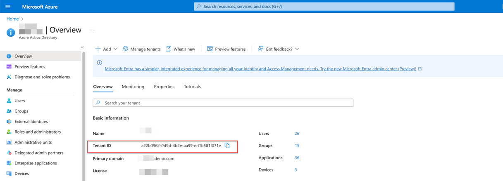
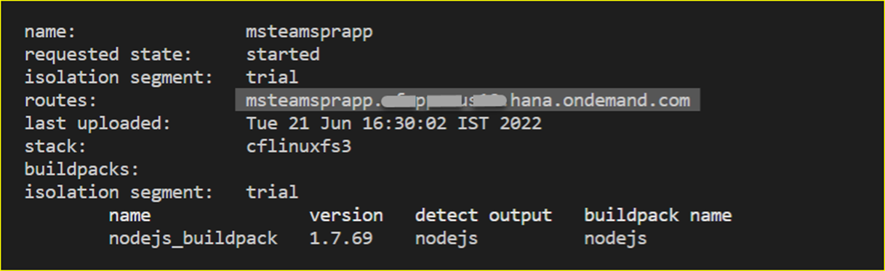

## Build and Deploy the Extension Application

In this section, you will clone the codebase and deploy the extension application in SAP BTP. 

### 1. Clone the GitHub Repository
    
Access the [Extend your SAP S/4HANA Business Scenarios into Microsoft Azure Ecosystem](https://github.com/SAP-samples/btp-msteams-extend-workflow) GitHub repository to download the project.

### 2. Check the Prerequisites for Deployment

Ensure you have created the service instance of **SAP Authorization and Trust Management** in your subaccount in the SAP BTP cockpit as described in the **Set Up SAP Authorization and Trust Management Service** section of the **Step 1 - Configure SAP BTP** page before deployment.

In case you changed the name of your SAP Authorization and Trust Management service instance from **wftaskdec-uaa-service** to something else, adjust the name in the **manifest.yml** file in the **deploy** folder of this project. 

### 3. Update the Configuration Files and Deploy the Extension Application

1. Open the **deploy** folder and rename the following files:

    - Rename **manifest.yml.sample** to **manifest.yml**

    - Rename **vars.yml.sample** to **vars.yml**

2. Open the **manifest.yml** file in the **deploy** folder and update the application name with a name of your choice.

     


3. Copy the configuration parameters from your subaccount in SAP BTP. 
    You do this in the SAP BTP cockpit.

    1. To update the **BTP_LANDSCAPE** variable, go to the **Overview** page of your subaccount. Choose **Cloud Foundry Environment** tab and copy the value of region in the **API Endpoint** URL. 

    2. To update the **BTP_ACCOUNT_NAME** variable, go to the **Overview** page of your subaccount. Go to the **General** section and copy the value of the **Subdomain**.

    3. To update the **XSUAA_CS_URL_SUFFIX** variable, navigate to your subaccount and choose **Security** >  **Trust configuration** and then choose **SAML Metadata** to download the metadata file. Open the metadata file and copy the value from the **Location** variable as shown in the screenshot.

         
        
        Make sure you do not include the subdomain of your subaccount in SAP BTP but only use the value after the last period.

4. Copy the configuration parameters from Microsoft Azure Portal.

    1. Log in to Microsoft Azure Portal and choose **Overview** and copy the value of **Tenant ID** to update **MICROSOFT_AD_TENANT_ID** variable.

         

    2. Go to **Azure Active Directory** > **Enterprise applications**. Select the application you created in step 8 of the **Configure Microsoft Azure Platform and MS Teams** page. 

    3. Choose **Expose an API** and copy the value from **Scopes** section to update **BTP_SCOPES** variable.

    4. Choose **Certificates & Secrets** and copy the value of **Secret ID** from **Client secrets** tab to update **MICROSOFT_APP_PASSWORD** variable.
    
    5. Go to the **Home** page and choose **Azure Bot Service**. Select the Azure Bot Service you created in step 10 **Configure Microsoft Azure Platform and MS Teams**. Choose **Configuration** and the copy the values of the service provider connection settings. These values will be used to update **CONNECTION_NAME_GRAPH** and **CONNECTION_NAME_BTP** variables.

    6. Go the **Home** page and choose **Azure Storage Account**. Select the Azure Storage Account you created in step 11 **Configure Microsoft Azure Platform and MS Teams**. Choose **Containers** and copy the value of the container you created to update **MICROSOFT_BLOB_CONTAINER_NAME** variable. 
    
        Next, choose **Access keys** and the copy the value **Connection string** to update 
        **MICROSOFT_BLOB_CONNECTION_STRING** variable.

5. Update vars.yml in the **deploy** folder with the values from the previous step.

    The following environment variables need to be set before you deploy the extension application in SAP BTP.
    
    | key    | value    |
    | --------|---------|
    |**SCENARIO**| For SAP S/4HANA, the value is **onpremise** and for SAP S/4HANA Private Cloud, use the **azureprivatecloud** value. Follow these steps to configure the additional settings required for SAP S/4HANA running on [Azure Private Cloud](../Azure-Private-Cloud-PrivateLink/README.md).|
    |**BTP_LANDSCAPE**|The region of your subaccount in SAP BTP. For example, eu20.|
    |**BTP_ACCOUNT_NAME**|The subdomain of your subaccount in SAP BTP. For example, trial-us-xjn2uwee9|
    |**XSUAA_CS_URL_SUFFIX**|The audience value (For example, azure-live-eu20 or aws-live-eu10 or aws-live) which can be extracted from the SAML metadata of your subaccount in SAP BTP.|
    |**BTP_SCOPES**|The full name of the custom scope created **Configure Microsoft Azure Platform and MS Teams** page from api:// to /access_as_user. For example, api://appname.cfapps.eu20.hana.ondemand.com/botid-ef84483e-546c-414c-b75a-d1er58c095c7/access_as_user|
    |**CONNECTION_NAME_GRAPH**|The name of the service provider connection settings in Azure Bot Service. For example, GraphConnection.|
    |**CONNECTION_NAME_BTP**|The name of the service provider connection settings in Azure Bot Service. For example, BTPConnection.|
    |**MICROSOFT_BLOB_CONTAINER_NAME**|The Azure Storage Account container name. For example, botstorage.|
    |**MICROSOFT_BLOB_CONNECTION_STRING**|The connection string in Azure Storage account. For example, DefaultEndpointsProtocol=https;AccountName=s4hanateams;AccountKey=fsagfss==;EndpointSuffix=core.windows.net|
    |**DOMAIN**| The Cloud Foundry domain of your extension application. Copy the application name you updated in manifest.json file and append .cfapps.region.hana.ondemand.com. Check your SAP BTP subaccount region and update accordingly. For example,btp-extendworkflow-s4-msteams.cfapps.eu20.hana.ondemand.com|
    |**MICROSOFT_APP_ID**| The Application(client) ID of your Azure Active Directory Enterprise application. For example, ed84483e-546c-424c-b75a-d1ab58c095c7.|
    |**MICROSOFT_APP_PASSWORD**|A Client secret which you created for your Azure Active Directory Enterprise application. For example, ssafdssdfsk0o6JMsWNBip7AQb5-asdasfdsf.|
    |**MICROSOFT_AD_TENANT_ID**|The unique ID of your Azure Active Directory. For example, a22b0962-0d9d-4b4e-aa99-we1b581f071w|
    |**SAP_CLIENT**|sap-client number of your SAP S/4HANA system. For example, 100.|
    |**ACCEPT_SELF_SIGNED_CERT**|true for development environment and false for production environment.|

6. Build and deploy the application. Run the following commands:

    1. Open the Cloud Foundry command line interface (cf CLI).

    2. Build your server application.

            ```
            npm install
            ```

    3. Log in to your subaccount in SAP BTP to deploy the extension application.
      Check your region and update the API endpoint accordingly. For example, "https://api.cf.region.hana.ondemand.com"

            ```
            cf login -a `<CF API endpoint>`
            ```

    4. Push the application to your subaccount.

            ```
            cd deploy
            cf push -f manifest.yml --vars-file vars.yml
            ```

    5. Once the application is deployed, copy its URL.

         

        You can also check the status of your application in the SAP BTP cockpit.

         

7. Update the application name in the Microsoft Azure App Registration.

    1. Log in to the Microsoft Azure Portal.

    2. Choose **Azure Active Directory** and then choose **App registrations**. 

    3. Choose the app registration you created and then choose **Overview** to copy the **Application(client)ID**.
      
         

    4. Choose **Authentication**. 
    
    5. In the **Platform configurations** section, choose **Web** > **Redirect URIs**.
    
    6. Choose **Add URI** to create a new entry with the URL of the extension application deployed in SAP BTP and append the **Application(client)ID** which you copied in the previous step.

        The URL should look like this:

            https://[deployed appname].cfapps.region.hana.ondemand.com/botid-[Application(client)ID]

        Your configuration should look like this:

         
    
    This application name needs to be updated in the **App Registration** configuration in Microsoft Azure Portal.

8. Update the **manifest.json** file in Microsoft Teams.

    1. Go to **/deploy/msteamsfiles** folder in your project directory. 
   
    2. Rename **manifest.json.sample** to **manifest.json**.

    3. Generate the GUID from command prompt. 
        
         

    4. Open the **manifest.json** file.
    
    5. Update the **msteamsappguid-placeholder** parameter with the value of the GUID.

      
        | key    | value    |
        | --------|---------|
        |**msteamsappguid-placeholder**|A unique GUID for the Microsoft Teams App. It can be generated using Windows PowerShell by invoking the command [guid]:: NewGUID. This GUID is for the Microsoft Teams environment only and is not the same as the Application Registration Client ID.|
        |**msappid-placeholder**|The Application(client) ID  of your Microsoft Azure Enterprise application. Refer to step 8 from **Configure Microsoft Azure Platform and MS Teams** page. You have noted this Application(client) ID in this step.|
        |**domain-placeholder:**|This is the runtime URL of your extension application in the SAP BTP.For example, sap-dev-teams.cfapps.eu20.hana.ondemand.com |

        Your **manifest.json** file should look like this:

         
         


9. Upload the **manifest.json** file to Microsoft Teams.

    Before you upload the manifest.json file of your extension application to Microsoft Teams, make sure that you have updated all the parameters in the manifest.json file.


    1. Once you have the configuration parameters updated, you must archive all files in the /deploy/msteamsfiles folder in a ZIP file.

         

    2. Log in to [Microsoft Teams Admin Center](https://admin.teams.microsoft.com/) with an Active Directory user who has a Microsoft Teams Administrator role assigned
    
    3. Upload the ZIP file. Once you have successfully uploaded the ZIP file, you should be able to see the extension application in the **Build for your org** section within Microsoft Teams.

         

        
10. Log in to [Microsoft Teams](https://teams.microsoft.com) and choose **Apps** > **Built for your org**. You should have the **SAP S/4HANA Business Events** application.

     


### 4. Create a Webhook Subscription in SAP Event Mesh

Follow these steps to configure the webhook subscription to receive notifications from SAP S/4HANA via SAP Event Mesh.

1. In the SAP BTP cockpit, navigate to your subaccount and choose **Services** > **Instances and Subscriptions**.

2. Go to the **Instance** tab, select the instance of **Authorization and Trust Management Service** and in the **Service Keys** tab, choose **Create**.

    

3. In the **Credentials** pop-up, copy the values of the **clientid**, **clientsecret**, and **url**.

    

4. Open the SAP Event Mesh application.

    - If you are using SAP BTP Enterprise account, go to the **Subscriptions** tab and choose **Event Mesh** to open the application.

    - If you are using SAP BTP Trial account, go to **Instances** tab, select the instance for **SAP Event Mesh** and choose **View Dashboard**.
      
5. Create a Webhook subscription.

    1. Choose **Webhook Subscriptions** and then choose **Create**.
    2. In the **Subscription** field, enter a name of your choice.
    3. In the **Queue Name** dropdown menu, select the queue you created in the **Set Up the Subaccount in SAP BTP** page.
    4. In the **Quality of Service** dropdown menu, select 1.
    5. In the **Webhook URL** field, enter **https://extensionapplicationURL/em/pr-workflow**. The **extensionapplicationURL** is the value you copied in Step 5 of **3. Update Configuration Files and Deploy**.
    
    6. In the **Exempt Handshake** field, select **Yes**.

    7. In the **Authentication** dropdown menu, select **OAuth2ClientCredentials**.

    8. In the **Client ID** , **Client Secret** and **Token URL** fields, enter the values you copied in step 3 of the **4. Create a Webhook Subscription in SAP Event Mesh** section. In the **Token URL** field, enter the URL from step 3 with the **/oauth/token** appended.
  
    9. Choose **Create**.

        Your Webhook subscription should look like this:
        
        

6. If the **Subscription Status** is paused, then choose the **Resume** icon from the **Actions** column. 

Now you have the extension application deployed in SAP BTP and the webhook configured.
