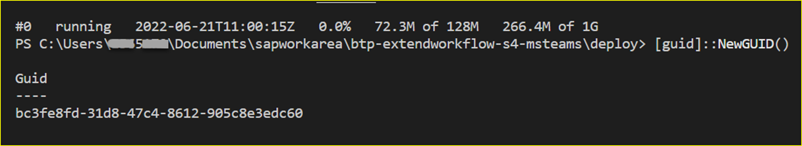

## Build and Deploy of SAP BTP Extension Application

In this section, you will clone the codebase and deploy the extension application in SAP BTP. 

### 1. Clone GitHub Repository
    
Access GitHub repository [Extend your SAP S/4HANA Business Scenarios into Microsoft Azure Ecosystem](https://github.com/SAP-samples/btp-msteams-extend-workflow) to download the project.

### 2. Check Pre-requisitcs for Deployment

Ensure you have created the service instance of **SAP Authorization and Trust Management** in your BTP subaccount as described in **Set Up SAP Authorization and Trust Management Service** section **Step 1 - Configure SAP BTP**.
before deployment.

In case you changed the name of your SAP Authorization and Trust Management service instance from **wftaskdec-uaa-service** to something else, please adjust the **manifest.yml** file in the deploy folder of this project. 

### 3. Update Configuration Files and Deploy

1. Go to the deploy folder and rename the samples files as shown below.

    Rename the **manifest.yml.sample** to **manifest.yml**

    Rename the **vars.yml.sample** to **vars.yml**

3. Update vars.yml from **deploy** folder.

    ```
        /deploy/vars.yml
    ```
    The following environment variables need to be set before you deploy the extension application to SAP BTP Cloud Foundry Runtime.

    **/deploy/vars.yaml**

    | key    | value    |
    | --------|---------|
    |**SCENARIO**| For SAP S/4HANA, the value is "onpremise" and for SAP S/4HANA Private Cloud, use the value "azureprivatecloud". Please follow the below steps to configure additional settings needed for SAP S/4HANA running on [Azure-Private-Cloud](../Azure-Private-Cloud-PrivateLink/README.md)  |
    |**BTP_LANDSCAPE**|The region of your SAP BTP subaccount e.g. eu20|
    |**BTP_ACCOUNT_NAME**|The subdomain of your SAP BTP subaccount|
    |**XSUAA_CS_URL_SUFFIX**|The audience value (e.g., azure-live-eu20 or aws-live-eu10 or aws-live) which can be extracted from the SAML metadata of your SAP BTP subaccount. Make sure you do not include the subdomain of your SAP BTP subaccount but only use the value after the last period|
    |**BTP_SCOPES**|The full name of the custom scope created in Step 2 Configure-Azure from api:// to /access_as_user|
    |**CONNECTION_NAME_GRAPH**|The name of the Microsoft Graph connection creates in Step 2 Configure-Azure e.g. GraphConnection|
    |**CONNECTION_NAME_BTP**|The name of the SAP BTP connection creates in Step 2 Configure-Azure e.g. BTPConnection|
    |**MICROSOFT_BLOB_CONTAINER_NAME**|The respective values copied in Step 2 - Configure-Azure|
    |**MICROSOFT_BLOB_CONNECTION_STRING**|The respective values copied in Step 2 - Configure-Azure|
    |**DOMAIN**| The Cloud Foundry domain of your Microsoft Teams extension application e.g. btp-extendworkflow-s4-msteams.cfapps.region.hana.ondemand.com (check the region and update accordingly) |
    |**MICROSOFT_APP_ID**| The Application Client Id of your Azure Active Directory App Registraiton |
    |**MICROSOFT_APP_PASSWORD**|A Client Secret which you created for your Azure Active Directory App Registration|
    |**MICROSOFT_AD_TENANT_ID**|The unique Id of your Azure Active Directory|
    |**SAP_CLIENT**|sap-client number of your SAP S/4HANA system that you are using|
    |**ACCEPT_SELF_SIGNED_CERT**|true for development environment and false for production environment|

4. Open the **manifest.yml** file from /deploy folder and update the application name. 

     


5. Build and deploy.Execute the below steps manually or by running the respective npm command.

    - Build your server application

            ```console
            npm install
            ```

     - Log in to your SAP BTP subaccount to deploy extension application.

            ```
            cf login -a `<CF API endpoint e.g. https://api.cf.region.hana.ondemand.com/>` <Check your region and accordingly update the API endpoint url>
            ```

     - Push the application to your dedicated subaccount.

            ```
            cd deploy
            cf push -f manifest.yml --vars-file vars.yml
            ```

    Once the application is deployed, copy the URL of the extension application.

     

    You can also check the status of your application in your SAP BTP cockpit.

     

6. Update the application name in App Registration

    - Log in to Microsoft Azure portal.

    - Choose **Azure Active Directory** and then choose **App registrations**. 

    - Choose the app registration you created and then choose **Overview** to copy the **Application(client)ID as shown in the screenshot.

         

    - Choose **Authentication**. 
    
    - Under **Platform configurations** section, choose **Web** > **Redirect URIs**.
    - Choose **Add URI** to create a new entry with the URL of the extension application deployed in SAP BTP and append the **Application(client)ID  which you copied in the previous step.

        The URL should look like below:

            https://[deployed appname].cfapps.region.hana.ondemand.com/botid-[Application(client)ID]

        Your configuration should look like this:
         
    
    This application name needs to be updated in **App Registration** configuration in Microsoft Azure.

7. Update manifest.json file in Microsoft Teams

   - Go to deploy->msteamsfiles folder in your project directory. 
   
        Rename **manifest.json.sample** to **manifest.json**.

    - Generate the GUID from command prompt as shown below. 
        
         

    - Open the manifest.json file.
    
    - To update the **msteamsappguid-placeholder** parameter, enter the value of GUID.

        **/deploy/msteamsfiles/mainfest.json**

        | key    | value    |
        | --------|---------|
        |**msteamsappguid-placeholder**|A unique GUID for the Microsoft Teams App. It can be generated using Windows PowerShell by invoking the command [guid]:: NewGUID. This GUID is for the Microsoft Teams environment only and does not equal the Application Registration Client Id.|
        |**msappid-placeholder**|Azure App Registration Client ID of your extension application.|
        |**domain-placeholder:**|The CF domain of your Microsoft Teams extension.|

        Your manifest.json file should look like this:
         


         


7. Upload the manifest definition to Microsoft Teams.

    - Before you upload the manifest definition of your extension app to Microsoft Teams, please make sure, that you have updated all parameters in the /deploy/msteamsfiles/manifest.json file.


    - Once you have the configuration parameters updated, you must zip all files in the /deploy/msteamsfiles folder.

         

    - Upload this zip file to [Microsoft Teams Admin Center](https://admin.teams.microsoft.com/). Log in with an Active Directory user who has a Microsoft Teams Administrator role assigned.

        Use the menu as shown below to upload your app.

         

        Once the upload is successful, you should be able to see the extension application in the Build for your org Section within Microsoft Teams, as shown below.

8. Log in to [Microsoft Teams](https://teams.microsoft.com) and check the **Apps** in Microsoft Teams. Your **Apps** > **Built for your org** should have **SAP S/4HANA Business Events** and should look like this:

     


### 4.Post Deployment 

Follow the below steps for configuring webhook to receive notifications from SAP S/4HANA via SAP Event Mesh.

1. In the SAP BTP cockpit, navigate to your subaccount and choose **Services** > **Instances and Subscriptions**.

2. Go to **Instance** tab, select the instance for **Authorization and Trust Management Service** and choose **Service Keys** to create. 

    

3. Copy the clientid,clientsecret and url from the **Credentials**

    

4. Open the SAP Event Mesh application.

    - If you are using SAP BTP Enterprise account, go to the **Subscriptions** tab and choose **Event Mesh** to open the application.

    - If you are using SAP BTP Trial account, go to **Instances** tab, select the instance for **SAP Event Mesh** and choose View Dashboard.
    
  
5. Create Webhook Subscription.

    - Choose **Webhook Subscriptions** and then choose **Create**.
    - In the **Subscription** field, enter name of your choice.
    - In the **Queue Name** field, select the queue you created in the tutorial **Step1-Configure-SAP-BTP** from the dropdown menu.
    - In the **Quality of Service** field, select 1 from the dropdown menu.
    - In the **Webhook URL** field, enter https://extensionapplicationURL/em/pr-workflow. The extensionapplicationURL is the value you copied in Step 5 of **3. Update Configuration Files and Deploy**.
    - In the **Exempt Handshake** field, select **Yes**
    - In the **Authentication** field, select **OAuth2ClientCredentials**
    - In the **Client ID** , **Client Secret** and **Token URL** field, enter the values your copied in step 3. For the **Token URL** field, append /oauth/token to the URL.
    - Choose **Create**

        Your Webhook Subscription should look like below:
        

6. If the **Subscription Status** is paused, then choose resume button from **Actions** column. 

This completes the deployment of the extension application in SAP BTP and the webhook configuration. 
