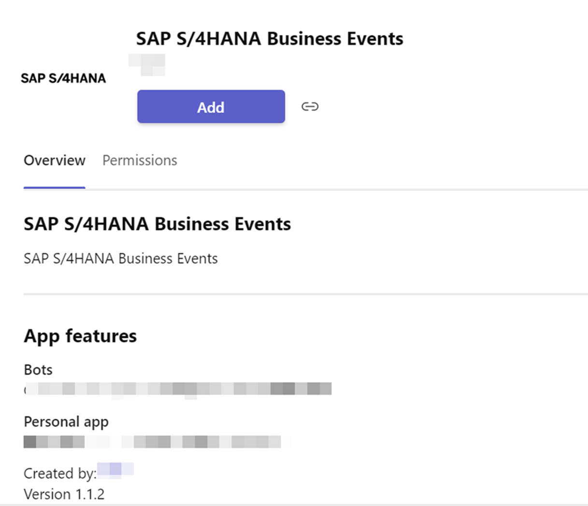

## Test the Extension Application

Now that you have successfully deployed the extension application in SAP BTP and uploaded the application manifest file in Microsoft Teams Admin Center, follow these steps to test the application.

1. Log in to SAP BTP cockpit, navigate to your subaccount and choose **Cloud Foundry** > **Spaces** and select your space.

2. You will see the deployed application under **Application**. Choose your application to view the details. It should be in **Started** state.

    

3. Log in to [Microsoft Teams](https://teams.microsoft.com) as a manager (a user who has the right authorization to approve purchase requisitions).

4. In Microsoft Teams, choose **Apps** > **Built for your org**. You will be able to see your application in the detail page. In case you do not see your application, check the manifest file uploaded in Microsoft Teams Admin Center.

    

5. Select your application and choose **Add**.

    

6.  Once the application has been added, you should be able to see a welcome message in Microsoft Teams.

       

7. Log in to the SAP S/4HANA system with a business user (not the manager) and create a purchase requisition.

    **Note**: This business user creates the purchase requisition and the manager approves or rejects it.

8. You will receive a notification for the purchase requisition approval in Microsoft Teams.

      

9. Check the details and choose **Approve Request** or **Reject Request**. Once the purchase requisition is approved or rejected, the status is updated.

      

You have completed the end-to-end integration of Microsoft Teams with SAP BTP and SAP S/4HANA.

### Troubleshooting

1. To access Microsoft Teams admin URL, make sure the test user has the Teams Administrator role assigned. This is also required to upload the application in Microsoft Teams Admin Center. <<TODO applicaiton or manifest?>>

2. Add Microsoft Teams Exploratory license to the test user, especially the Exchange Online (Plan 1) License without which some resources like **https://graph.microsoft.com/v1.0/me/calendar** will not be available in Microsoft Graph API. 

3. Make sure you import the GitHub certificate by following the [abapGit documentation](https://docs.abapgit.org/guide-ssl-setup.html) before executing <<TODO ref>> Step 33 in [Step3-Configure-SAP-S4HANA](../Step3-Configure-SAP-S4HANA/README.md) to avoid SSL certificate errors.

4. In SAP S/4HANA 2020 or higher, the **Clone Repository** option is not availablew in the ABAP Git program. When creating an online repository, a local copy is created automatically. Hence, the <<TODO ref>> Clone Online Repo step can be avoided in these systems and Pull step can be executed directly. 

5. In case of you get an **Unauthorized** error in the webhook, make sure that the role created by SAP Authorization and Trust Management service instance is added to the Role Collection mapped in the trust configuration. If this does not solve the issue the Role Collection should be added manually to the user. <<TODO ref>>

6. In case you get an **Unauthorized** error in the destination configuration, you have to change the principal propagation type to **X.509 Certificate (Strict Usage)** in the Cloud Connector. 

7. In the Azure Bot Service, make sure to pass all the scopes while adding the Graph Connection to prevent the **403 Forbidden** error from happening. When you test the connection, you have to test it with a test user and provide all the permissions for this user.

