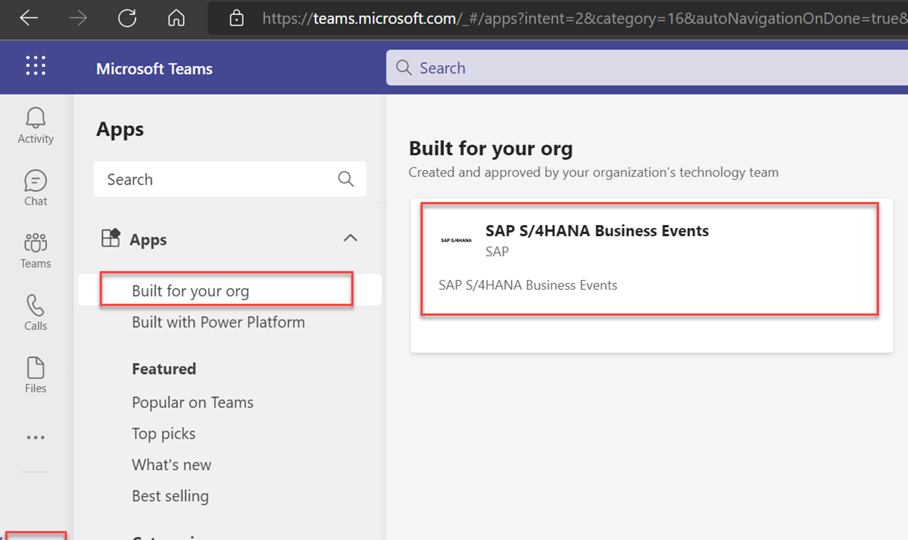

## Test the application.

Now that you have successfully deployed the Extension application to SAP BTP and uploaded the application manifest  Microsoft Teams Admin Center in the previous steps let us go ahead and test the application.

1. Log in to SAP BTP Cockpit and check your application. It should be in started state.

2. Log in to Microsoft Teams as a manager (a user who has access to approve PR).

    Install the custom app by following the below steps.

    Select the application and add the application.

    Once the app has been added, you should be able to see the below in your MS Teams with the below Welcome message.
    

3. log in to your SAP S/4HANA as the business user and create a Purchase Requisition.

4. You will receive the notification for PR Approval as shown below.
  

5. Check the details and click on the respective Approve/Reject button to Approve/Reject PR. Once the PR is approved, the status is updated, as shown below.

      

Congratulations! You have completed the end-to-end integration with Microsoft Teams and SAP S/4HANA.